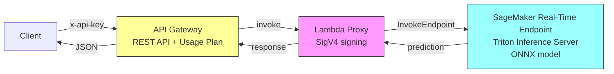
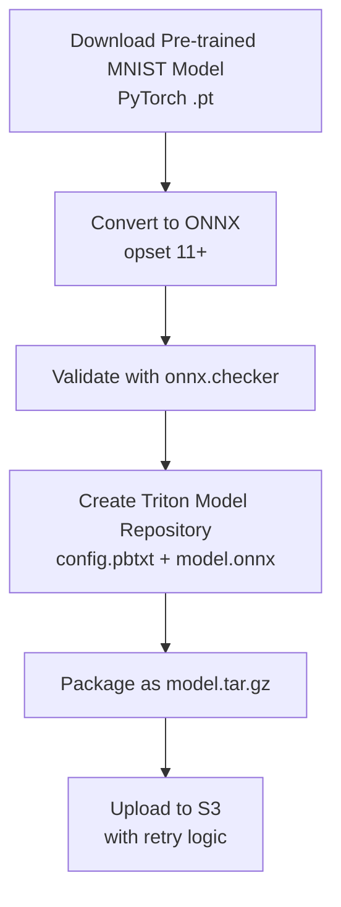
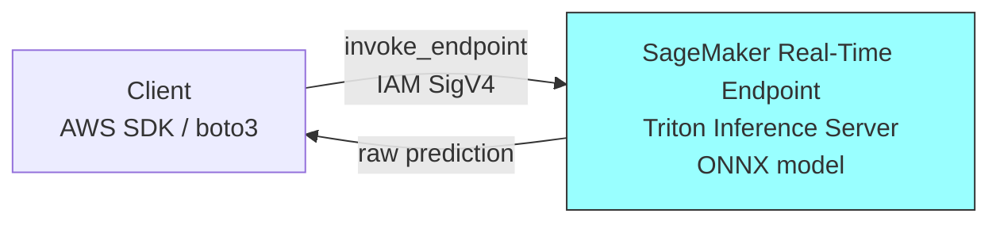
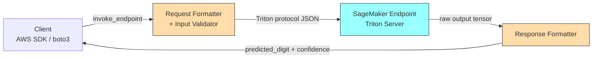
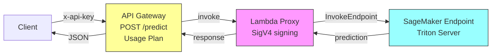
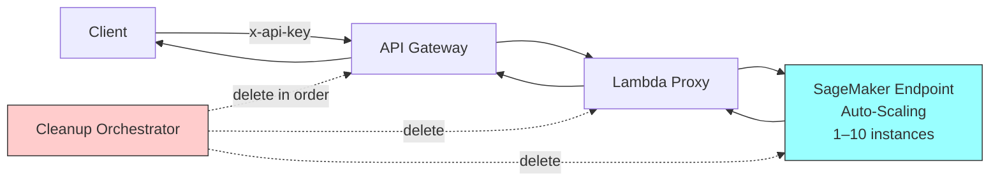

# Design Document: MNIST Inference Endpoint

## Overview

This system downloads a pre-trained MNIST handwriting recognition model, converts it to ONNX format, packages it in a Triton-compatible model repository, uploads it to S3, and deploys it as a real-time SageMaker inference endpoint behind API Gateway with API key authentication.

The architecture follows Option 4 from the research (SageMaker Real-Time Endpoint) with a Lambda proxy for API Gateway integration, chosen for sub-1-second latency requirements and ONNX + Triton for zero-code inference serving.

**Design follows an incremental layered approach.** Each layer builds on the previous one. Layer 1 delivers a minimal working endpoint that can be invoked directly via the AWS SDK (`invoke_endpoint`). Subsequent layers add request/response formatting, external access via API Gateway, and production hardening.

### Target State Architecture (All Layers)



> **Note:** Layer 1 works without Lambda or API Gateway. The client invokes the SageMaker endpoint directly using the AWS SDK with IAM credentials.

## Architecture

The system is composed of two main workflows, built up incrementally across layers.

---

### Layer 1 — Minimal Working Endpoint (Requirements 1–3)

Layer 1 delivers the core: model packaging, S3 upload, and a bare SageMaker endpoint that can be invoked directly via `boto3.invoke_endpoint()`.

#### Model Preparation Pipeline (Offline)



#### Inference Path (Layer 1)



At this stage, the client sends a raw Triton-protocol payload directly and receives the raw model output tensor.

---

### Layer 2 — Inference Protocol and Validation (Requirement 4)

Layer 2 adds request/response formatting components that shape the Triton protocol payloads and validate inputs before they reach the model.



The formatting and validation components run client-side (or in a thin orchestration layer) to ensure payloads conform to the Triton V2 inference protocol.

---

### Layer 3 — External Access (Requirement 5)

Layer 3 adds the full Lambda proxy and API Gateway chain so external applications can call the endpoint without AWS credentials.



---

### Layer 4 — Production Hardening (Requirements 6–7)

Layer 4 adds auto-scaling configuration and a cleanup orchestrator for cost management.



---

### Key Design Decisions

| Decision | Choice | Rationale |
|----------|--------|-----------|
| Model format | ONNX | Triton native support, no custom inference code needed |
| Serving container | Triton Inference Server (CPU) | Zero-code serving for ONNX, dynamic batching, high performance |
| Deployment mode | SageMaker Real-Time | Sub-1-second latency, no cold starts |
| Authentication | API Gateway + API key | External apps without AWS credentials |
| Lambda proxy | Required | SageMaker requires IAM SigV4 auth; Lambda bridges API Gateway to SageMaker |
| Instance type | CPU-only (ml.c5.large default) | MNIST is lightweight; GPU overkill for 28x28 image classification |
| Region | eu-west-1 | Configured deployment region |

## Components and Interfaces

Components are grouped by the layer that introduces them.

---

### Layer 1 Components

#### 1. Model Packager (`model_packager.py`)

Responsible for the offline model preparation pipeline.

```python
class ModelPackager:
    """Downloads, converts, validates, packages, and uploads the MNIST model."""

    def __init__(self, config: PackagerConfig):
        """Initialize with configuration (source URL, S3 bucket, prefix)."""

    def download_model(self) -> Path:
        """Download pre-trained MNIST model from configured source.
        Raises: DownloadError on network failure."""

    def convert_to_onnx(self, model_path: Path) -> Path:
        """Convert PyTorch model to ONNX format (opset >= 11).
        Raises: ConversionError if model cannot be converted."""

    def validate_onnx(self, onnx_path: Path) -> None:
        """Validate ONNX model using onnx.checker.check_model.
        Raises: ValidationError if model is structurally invalid."""

    def create_model_repository(self, onnx_path: Path) -> Path:
        """Create Triton model repository directory structure.
        Returns path to the repository root."""

    def package_artifact(self, repo_path: Path) -> Path:
        """Package model repository as model.tar.gz.
        Returns path to the archive."""

    def upload_to_s3(self, artifact_path: Path) -> str:
        """Upload artifact to S3 with retry logic (3 attempts, 1s delay).
        Returns S3 URI (s3://bucket/key).
        Raises: UploadError after 3 failed attempts."""

    def run(self) -> str:
        """Execute full pipeline. Returns S3 URI of uploaded artifact."""
```

#### 2. Endpoint Deployer (`endpoint_deployer.py`) — Basic Deployment

Manages SageMaker endpoint creation and deployment (basic functionality for Layer 1).

```python
class EndpointDeployer:
    """Deploys and manages SageMaker Triton endpoint."""

    def __init__(self, config: DeployerConfig):
        """Initialize with deployment config (instance type, endpoint name, region)."""

    def get_triton_image_uri(self, region: str) -> str:
        """Retrieve CPU Triton container image URI for the given region."""

    def create_model(self, model_data_url: str) -> str:
        """Create SageMaker model resource. Returns model name."""

    def create_endpoint_config(self, model_name: str, instance_type: str) -> str:
        """Create endpoint configuration. Returns config name."""

    def create_endpoint(self, config_name: str) -> str:
        """Create endpoint and wait for InService (timeout: 15 min).
        Returns endpoint name.
        Raises: DeploymentError if endpoint fails to reach InService."""
```

---

### Layer 2 Components

#### 3. Input Validator (`input_validator.py`)

Validates inference request payloads.

```python
class InputValidator:
    """Validates Triton inference protocol requests for MNIST model."""

    EXPECTED_SHAPE = [1, 28, 28]
    EXPECTED_DTYPE = "FP32"
    MAX_PAYLOAD_SIZE = 1_048_576  # 1 MB

    def validate(self, payload: dict) -> ValidationResult:
        """Validate inference request payload.
        Checks: tensor shape, data type, required fields, payload size.
        Returns ValidationResult(valid=True/False, error_message=...)."""
```

#### 4. Response Formatter (`response_formatter.py`)

Formats model output into client-friendly responses.

```python
class ResponseFormatter:
    """Formats Triton model output into prediction response."""

    def format_prediction(self, model_output: list[float]) -> PredictionResponse:
        """Convert 10-class probability distribution to prediction response.
        Returns PredictionResponse(digit=argmax, confidence=max_prob)."""
```

#### 5. Request Formatter (`request_formatter.py`)

Constructs Triton inference protocol requests.

```python
class RequestFormatter:
    """Constructs Triton inference protocol JSON payloads."""

    def format_request(self, input_data: list[float], model_name: str = "mnist") -> dict:
        """Convert flat FP32 array (784 values) to Triton inference protocol JSON.
        Returns dict matching Triton V2 inference protocol structure."""
```

---

### Layer 3 Components

#### 6. Lambda Proxy (`lambda_handler.py`)

Lambda function that proxies API Gateway requests to SageMaker.

```python
def handler(event: dict, context) -> dict:
    """Lambda handler that:
    1. Extracts request body from API Gateway event
    2. Invokes SageMaker endpoint using boto3 (IAM SigV4 automatic)
    3. Returns response formatted for API Gateway proxy integration
    Handles errors: 502 for Lambda/SageMaker failure, pass-through for SageMaker errors."""
```

#### 7. API Gateway Setup (`api_gateway_setup.py`)

Creates and configures API Gateway resources.

```python
class ApiGatewaySetup:
    """Manages API Gateway REST API, API key, usage plan, and Lambda integration."""

    def deploy(self, lambda_arn: str) -> ApiGatewayOutput:
        """Create full API Gateway stack:
        - REST API with POST /predict
        - API key requirement
        - Usage plan (default: 10 rps, burst 20)
        - Lambda integration
        Returns ApiGatewayOutput(invoke_url, api_key_value)."""

    def delete(self) -> None:
        """Remove all API Gateway resources in dependency order."""
```

---

### Layer 4 Components

#### Endpoint Deployer — Extended Methods (added in Layer 4)

```python
class EndpointDeployer:
    # ... (Layer 1 methods above) ...

    def validate_instance_type(self, instance_type: str) -> None:
        """Validate instance type is CPU-only from allowed families.
        Raises: InvalidInstanceTypeError for GPU or unsupported types."""

    def configure_auto_scaling(self, endpoint_name: str, min_instances: int, max_instances: int, target_invocations: int) -> None:
        """Configure auto-scaling policy based on invocations per instance."""

    def delete_endpoint(self, endpoint_name: str) -> DeletionSummary:
        """Delete endpoint, config, and model in dependency order.
        Returns summary with per-resource status."""
```

#### 8. Cleanup Orchestrator (`cleanup.py`)

Handles deletion of all resources.

```python
class CleanupOrchestrator:
    """Orchestrates deletion of all deployed resources."""

    def delete_all(self, endpoint_name: str, api_gateway_id: str) -> CleanupSummary:
        """Delete all resources in correct dependency order:
        1. API Gateway, usage plan, API key
        2. Lambda function and IAM role
        3. SageMaker endpoint, config, model
        Continues on individual failures, returns per-resource summary."""
```

## Data Models

### Configuration

```python
@dataclass
class PackagerConfig:
    model_source_url: str          # URL to download pre-trained model
    s3_bucket: str                 # Target S3 bucket name
    s3_prefix: str = "models/mnist/"  # S3 key prefix
    onnx_opset_version: int = 11   # Minimum ONNX opset version

@dataclass
class DeployerConfig:
    endpoint_name: str             # SageMaker endpoint name
    instance_type: str = "ml.c5.large"  # Default CPU instance
    initial_instance_count: int = 1
    region: str = "eu-west-1"
    model_name: str = "mnist-triton"
```

### Triton Model Repository Structure

```
model_repository/
  mnist/
    config.pbtxt
    1/
      model.onnx
```

### config.pbtxt

```protobuf
name: "mnist"
platform: "onnxruntime_onnx"
max_batch_size: 8
input [
  {
    name: "input"
    data_type: TYPE_FP32
    dims: [1, 28, 28]
  }
]
output [
  {
    name: "output"
    data_type: TYPE_FP32
    dims: [10]
  }
]
```

### Triton Inference Protocol (Request)

```json
{
  "inputs": [
    {
      "name": "input",
      "shape": [1, 1, 28, 28],
      "datatype": "FP32",
      "data": [0.0, 0.0, ..., 0.0]
    }
  ]
}
```

### Triton Inference Protocol (Response)

```json
{
  "outputs": [
    {
      "name": "output",
      "shape": [1, 10],
      "datatype": "FP32",
      "data": [0.01, 0.01, 0.02, 0.9, 0.01, 0.01, 0.01, 0.01, 0.01, 0.01]
    }
  ]
}
```

### Prediction Response (Client-facing)

```json
{
  "predicted_digit": 3,
  "confidence": 0.9,
  "probabilities": [0.01, 0.01, 0.02, 0.9, 0.01, 0.01, 0.01, 0.01, 0.01, 0.01]
}
```

### Deletion Summary

```python
@dataclass
class ResourceDeletionResult:
    resource_type: str             # "endpoint", "endpoint_config", "model"
    resource_id: str               # Resource identifier
    success: bool
    error_message: str | None = None

@dataclass
class DeletionSummary:
    results: list[ResourceDeletionResult]
    all_successful: bool
```

### Allowed Instance Types

```python
ALLOWED_CPU_FAMILIES = [
    "ml.c4", "ml.c5", "ml.c5d",
    "ml.m4", "ml.m5", "ml.m5d",
    "ml.t2", "ml.t3"
]

GPU_FAMILIES = [
    "ml.p2", "ml.p3", "ml.p4",
    "ml.g4dn", "ml.g5", "ml.inf1"
]
```

## Correctness Properties

*A property is a characteristic or behavior that should hold true across all valid executions of a system — essentially, a formal statement about what the system should do. Properties serve as the bridge between human-readable specifications and machine-verifiable correctness guarantees.*

Properties are organized by layer to match the incremental implementation approach.

---

### Layer 1 — Minimal Working Endpoint

#### Property 1: Model artifact packaging round-trip

*For any* valid Triton model repository directory structure (containing config.pbtxt and a numbered version subdirectory with model.onnx), packaging it into a tar.gz archive and extracting it should produce a directory tree with identical file paths and file contents.

**Validates: Requirements 1.6**

#### Property 2: S3 upload retry behavior

*For any* sequence of upload attempts where the first N attempts fail (N <= 3), the system should retry with at least 1 second delay between attempts. If N < 3, the (N+1)th attempt should succeed. If all 3 attempts fail, the system should raise an error containing the failure reason.

**Validates: Requirements 2.3, 2.5**

#### Property 3: S3 URI construction

*For any* valid S3 bucket name and key prefix, the returned URI after successful upload should match the format `s3://{bucket}/{prefix}{artifact_filename}` and be a valid S3 URI.

**Validates: Requirements 2.4**

---

### Layer 2 — Inference Protocol and Validation

#### Property 4: Triton request formatting

*For any* valid flat array of exactly 784 FP32 values (representing a 28x28 grayscale image), the request formatter should produce a JSON payload conforming to the Triton V2 inference protocol with correct input name, shape [1, 1, 28, 28], datatype "FP32", and all 784 data values preserved.

**Validates: Requirements 4.3**

#### Property 5: Response formatting produces valid predictions

*For any* valid 10-element probability distribution (non-negative values summing to approximately 1.0) from the model output, the response formatter should produce a predicted digit that equals the index of the maximum value (0-9) and a confidence score equal to that maximum value (between 0.0 and 1.0).

**Validates: Requirements 4.1, 4.4**

#### Property 6: Input validation rejects all invalid payloads

*For any* input payload that violates at least one constraint (tensor shape not [1, 28, 28], data type not FP32, missing required fields, or payload size exceeding 1 MB), the input validator should reject it with a specific error message identifying which constraint was violated.

**Validates: Requirements 4.5**

---

### Layer 3 — External Access

No new correctness properties for Layer 3. The Lambda proxy and API Gateway are tested via integration tests (API key authentication, rate limiting, error pass-through). These are infrastructure wiring concerns rather than pure logic with universal properties.

---

### Layer 4 — Production Hardening

#### Property 7: Instance type validation

*For any* instance type string, the validator should accept it if and only if it starts with one of the allowed CPU-only prefixes (ml.c4, ml.c5, ml.c5d, ml.m4, ml.m5, ml.m5d, ml.t2, ml.t3). All GPU families (ml.p2, ml.p3, ml.p4, ml.g4dn, ml.g5, ml.inf1) and unrecognized types should be rejected with a descriptive error message.

**Validates: Requirements 6.1, 6.4, 6.5**

#### Property 8: Resilient ordered deletion with complete summary

*For any* set of endpoint resources and any combination of individual deletion successes/failures, the system should: (a) attempt deletions in dependency order (endpoint -> endpoint_config -> model), (b) continue attempting remaining deletions even if earlier ones fail, (c) treat non-existent resources as successfully deleted, and (d) return a summary containing an entry for every resource with its success/failure status.

**Validates: Requirements 7.1, 7.2, 7.3, 7.4, 7.5**

## Error Handling

### Layer 1 — Model Packager Errors

| Error Scenario | Behavior | Exit Code |
|---|---|---|
| Network failure during download | Log error details, exit | Non-zero |
| Corrupted model file | Log validation error, exit | Non-zero |
| ONNX conversion failure | Log conversion error, exit | Non-zero |
| ONNX validation failure | Log checker output, exit | Non-zero |
| S3 upload failure (transient) | Retry up to 3 times, 1s delay | - |
| S3 upload failure (exhausted) | Log failure cause, exit | Non-zero |

### Layer 1 — Endpoint Deployer Errors

| Error Scenario | Behavior |
|---|---|
| Deployment timeout (15 min) | Report failure reason, delete partial resources within 5 min |
| SageMaker API errors | Propagate with context |

### Layer 2 — Inference Validation Errors

| Error Scenario | HTTP Status | Response |
|---|---|---|
| Invalid input (shape/type/size) | 400 | Error message with specific validation failure |
| Model unavailable | 503 | Service temporarily unavailable |

### Layer 3 — Lambda and API Gateway Errors

| Error Scenario | HTTP Status | Response |
|---|---|---|
| Missing/invalid API key | 403 | Forbidden |
| Payload exceeds 1 MB | 413 | Payload too large |
| Lambda execution failure | 502 | Internal server error |
| SageMaker invocation error | Pass-through | Error from SageMaker |
| Lambda timeout | 504 | Gateway timeout |

### Layer 4 — Production Hardening Errors

| Error Scenario | Behavior |
|---|---|
| Invalid instance type | Reject immediately with descriptive error |
| Individual resource deletion failure | Log and continue with remaining resources |
| Non-existent resource during deletion | Treat as already deleted (idempotent) |

## Testing Strategy

### Unit Tests

Unit tests cover the pure logic components with specific examples and edge cases, organized by layer:

**Layer 1:**
- Model repository structure: Verify correct directory layout, config.pbtxt content
- Config.pbtxt generation: Verify platform, input/output shapes, data types
- S3 URI construction: Specific bucket/key combinations
- Default configuration: Verify default instance count

**Layer 2:**
- Input validation: Specific invalid payloads (wrong shape, wrong type, missing fields, oversized)
- Response formatting: Known model outputs mapped to expected predictions
- Request formatting: Known image arrays mapped to expected Triton protocol JSON

**Layer 3:**
- Lambda handler: Verify event extraction, error formatting for API Gateway proxy integration

**Layer 4:**
- Instance type validation: Concrete examples of valid/invalid types
- Deletion ordering: Verify dependency order with mocked clients
- Default configuration: Verify usage plan limits

### Property-Based Tests

Property-based tests validate universal correctness guarantees using [Hypothesis](https://hypothesis.readthedocs.io/) (Python):

**Layer 1:**
- **Property 1**: Generate random valid directory structures, package/extract, verify roundtrip
- **Property 2**: Generate random failure sequences (0-4 failures), verify retry behavior
- **Property 3**: Generate random valid bucket names and prefixes, verify URI format

**Layer 2:**
- **Property 4**: Generate random 784-element FP32 arrays, verify Triton protocol compliance
- **Property 5**: Generate random 10-element probability distributions, verify argmax and range
- **Property 6**: Generate random invalid inputs (wrong shapes, types, oversized), verify rejection

**Layer 4:**
- **Property 7**: Generate random instance type strings, verify accept/reject classification
- **Property 8**: Generate random resource sets with random success/failure outcomes, verify ordering and completeness

Each property test runs a minimum of 100 iterations. Test tags follow the format:
**Feature: mnist-inference-endpoint, Property {N}: {description}**

### Integration Tests

Integration tests verify AWS service interactions with mocked/real services, organized by layer:

**Layer 1:**
- Model download: Verify download from configured source
- S3 upload: Verify upload with correct key prefix
- SageMaker deployment: Verify model, config, and endpoint creation API calls

**Layer 2:**
- End-to-end inference: Submit sample digit image, verify prediction response format

**Layer 3:**
- Lambda invocation: Verify SigV4 signed request to SageMaker
- API Gateway: Verify API key requirement, rate limiting, payload size limit

**Layer 4:**
- Cleanup: Verify all resources are removed in correct order

### Smoke Tests

- Endpoint accessible via HTTPS
- Health check returns 200 within 3 seconds
- Container image uses CPU variant
- ONNX opset version compatibility with container
