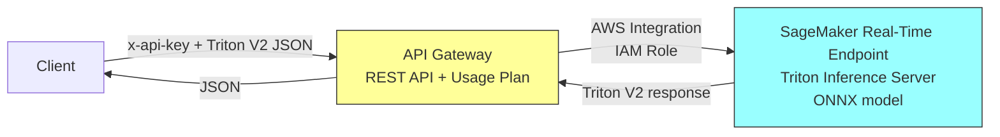
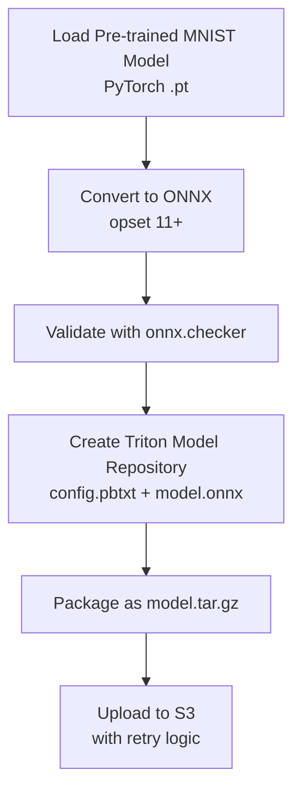
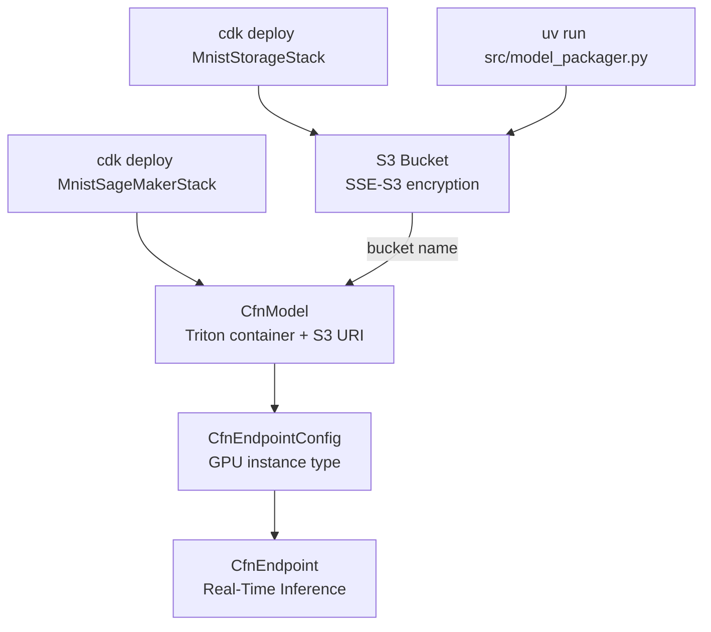
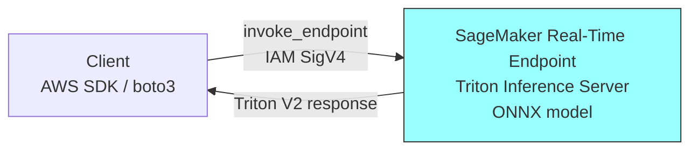
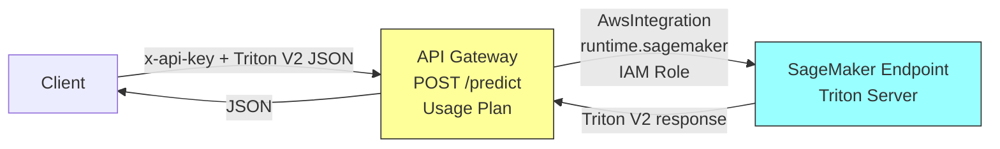
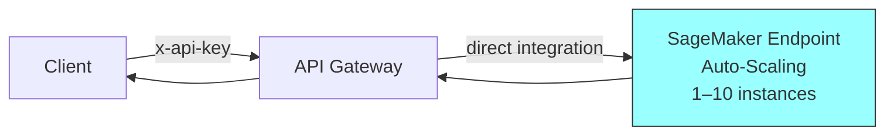

# Design Document: MNIST Inference Endpoint

## Overview

This system loads a locally-trained MNIST handwriting recognition model, converts it to ONNX format, packages it in a Triton-compatible model repository, uploads it to S3, and deploys it as a real-time SageMaker inference endpoint behind API Gateway with API key authentication.

The infrastructure is defined declaratively using **AWS CDK (Python)**. CDK manages all cloud resources (SageMaker endpoint, API Gateway) through CloudFormation stacks, providing reproducible deployments, proper dependency ordering, and `cdk destroy` for cleanup.

The architecture uses **direct API Gateway → SageMaker integration** (no Lambda). API Gateway calls the SageMaker endpoint directly using an AWS service integration with IAM role-based authentication. Clients send and receive **raw Triton V2 protocol JSON** — no request/response transformation is performed by the infrastructure.

**Design follows an incremental layered approach:**
- **Layer 1**: Model packaging (offline) + S3 bucket + SageMaker endpoint
- **Layer 2**: API Gateway with direct SageMaker integration, API key, usage plan
- **Layer 3**: Production hardening (auto-scaling + instance type validation)

### Target State Architecture



> **Note:** Layer 1 works without API Gateway. The client invokes the SageMaker endpoint directly using the AWS SDK with IAM credentials.

## Architecture

The system is composed of two main concerns:

1. **Offline Model Preparation** — `model_packager.py` runs locally before deployment to produce the S3 model artifact.
2. **Infrastructure** — CDK stacks define all AWS resources declaratively.

---

### Project Structure

```
infra/                          ← CDK app (Python)
  app.py                        ← CDK app entry point
  stacks/
    __init__.py
    storage_stack.py            ← S3 bucket for model artifacts
    sagemaker_stack.py          ← SageMaker model, endpoint config, endpoint, auto-scaling
    api_stack.py                ← API Gateway with direct SageMaker integration, API key, usage plan

src/                            ← Application code (offline tools only)
  __init__.py
  config.py                     ← PackagerConfig dataclass
  exceptions.py                 ← Custom exception classes
  model_packager.py             ← Offline model preparation pipeline

model/                          ← Training & local testing (unchanged)
  train.py
  draw_digit.py
  test_predict.py
  test_predict_sample.py

tests/                          ← Unit and property-based tests
```

---

### Layer 1 — Minimal Working Endpoint (Requirements 1–3)

Layer 1 delivers the core: model packaging (offline), S3 upload, and a SageMaker endpoint deployed via CDK.

#### Model Preparation Pipeline (Offline — runs before `cdk deploy`)



#### Infrastructure Deployment (CDK — `StorageStack` → `SageMakerStack`)



#### Inference Path (Layer 1 — Direct SDK Access)



At this stage, the client sends a raw Triton V2 protocol payload directly and receives the raw Triton response. No transformation is applied.

---

### Layer 2 — External Access (Requirement 4, 5)

Layer 2 adds API Gateway with **direct AWS service integration** to SageMaker. No Lambda function is used — API Gateway calls `sagemaker:InvokeEndpoint` directly via an IAM execution role.



Key aspects of the direct integration:
- API Gateway uses `AwsIntegration` with `service="runtime.sagemaker"` and `action="InvokeEndpoint"`
- An IAM role attached to the integration grants `sagemaker:InvokeEndpoint` on the specific endpoint ARN
- Request passes through directly — client sends raw Triton V2 JSON, receives raw Triton V2 response
- Error mapping: API Gateway integration response patterns map SageMaker errors to HTTP status codes (e.g., `4\d{2}` → 400, `5\d{2}` → 503)
- Triton handles input validation natively (wrong shape, wrong dtype, missing fields → Triton error response)

---

### Layer 3 — Production Hardening (Requirements 6–7)

Layer 3 adds auto-scaling configuration in `SageMakerStack` and instance type validation as a CDK construct-level check.



Cleanup is handled by `cdk destroy` — CDK deletes resources in correct dependency order automatically.

---

### Key Design Decisions

| Decision | Choice | Rationale |
|----------|--------|-----------|
| Infrastructure tool | AWS CDK (Python) | Declarative, reproducible, proper dependency ordering, drift detection |
| Stack separation | Separate stacks (Storage, SageMaker, API) | Independent lifecycle; bucket persists across endpoint redeployments |
| Model format | ONNX | Triton native support, no custom inference code needed |
| Serving container | Triton Inference Server (GPU) | Zero-code serving for ONNX, dynamic batching, high performance; DLC only available as GPU image |
| Deployment mode | SageMaker Real-Time | Sub-1-second latency, no cold starts |
| API Gateway integration | Direct AWS service integration (no Lambda) | Simplicity — no Lambda cold starts, no code to maintain, lower latency |
| Input validation | Triton native | Triton validates tensor shape, dtype, and required fields natively |
| Request/response format | Raw Triton V2 protocol pass-through | No transformation needed; clients speak Triton protocol directly |
| Authentication | API Gateway + API key | External apps without AWS credentials |
| Instance type | GPU (ml.g4dn.xlarge default) | Triton DLC only provides GPU container images; ml.g4dn.xlarge is the cheapest GPU option (~$0.74/hr vs ~$0.10/hr for ml.c5.large) |
| S3 bucket encryption | SSE-S3 | Default encryption for model artifacts at rest |
| Cleanup | `cdk destroy` | CDK handles dependency-ordered deletion natively |
| Region | eu-west-1 | Configured deployment region |

## Components and Interfaces

Components are grouped by the layer that introduces them.

---

### Layer 1 Components

#### 1. Storage Stack (`infra/stacks/storage_stack.py`) — CDK

Defines the S3 bucket for model artifacts as a separate, independently deployable stack.

```python
class StorageStack(Stack):
    """CDK stack for the S3 bucket that stores model artifacts."""

    def __init__(self, scope: Construct, id: str, **kwargs):
        """Creates an S3 bucket with:
        - Server-side encryption (SSE-S3)
        - Removal policy DESTROY (dev/test)
        - Auto-delete objects enabled (dev/test)
        """

    # Exposed attributes for cross-stack reference
    bucket_name: str  # CloudFormation output (CfnOutput)
    bucket_arn: str   # CloudFormation output (CfnOutput)
```

**Resources created:**
- `s3.Bucket` — encrypted with SSE-S3, removal policy DESTROY, auto-delete objects enabled
- CloudFormation outputs: bucket name, bucket ARN

#### 2. Model Packager (`src/model_packager.py`) — Offline Tool

Responsible for the offline model preparation pipeline. Runs locally before `cdk deploy MnistSageMakerStack`. Accepts the target bucket name from config or StorageStack CloudFormation output.

```python
class ModelPackager:
    """Loads, converts, validates, packages, and uploads the MNIST model."""

    def __init__(self, config: PackagerConfig):
        """Initialize with configuration (model path, S3 bucket, prefix)."""

    def convert_to_onnx(self, model_path: Path) -> Path:
        """Convert PyTorch model to ONNX format (opset >= 11).
        Raises: ModelLoadError if file not found.
        Raises: ConversionError if model cannot be converted."""

    def validate_onnx(self, onnx_path: Path) -> None:
        """Validate ONNX model using onnx.checker.check_model.
        Raises: ValidationError if model is structurally invalid."""

    def create_model_repository(self, onnx_path: Path) -> Path:
        """Create Triton model repository directory structure.
        Returns path to the repository root."""

    def package_artifact(self, repo_path: Path) -> Path:
        """Package model repository as model.tar.gz.
        Returns path to the archive."""

    def upload_to_s3(self, artifact_path: Path) -> str:
        """Upload artifact to S3 with retry logic (3 attempts, 1s delay).
        Returns S3 URI (s3://bucket/key).
        Raises: UploadError after 3 failed attempts."""

    def run(self) -> str:
        """Execute full pipeline. Returns S3 URI of uploaded artifact."""
```

#### 3. SageMaker Stack (`infra/stacks/sagemaker_stack.py`) — CDK

Defines all SageMaker resources as a CloudFormation stack. Accepts `model_bucket` and `model_key` as inputs.

```python
class SageMakerStack(Stack):
    """CDK stack for SageMaker model, endpoint config, endpoint, and auto-scaling."""

    def __init__(self, scope: Construct, id: str,
                 model_bucket: str,
                 model_key: str,
                 instance_type: str = "ml.g4dn.xlarge",
                 **kwargs):
        """
        Args:
            model_bucket: S3 bucket name containing the model artifact.
            model_key: S3 object key for the model.tar.gz artifact.
            instance_type: GPU SageMaker instance type (Triton DLC requires GPU).

        Raises ValueError if instance_type is not a supported GPU type.
        """

    # Exposed attributes for cross-stack reference
    endpoint_name: str  # CloudFormation output
```

**Resources created:**
- `CfnModel` — references S3 model artifact URI and Triton container image (GPU, eu-west-1)
- `CfnEndpointConfig` — production variant with specified GPU instance type, initial count = 1
- `CfnEndpoint` — the real-time inference endpoint
- Application Auto Scaling — target tracking on `SageMakerVariantInvocationsPerInstance` (min 1, max 10)
- Instance type validation in constructor (rejects CPU/unsupported types)

---

### Layer 2 Components

#### 4. API Stack (`infra/stacks/api_stack.py`) — CDK

Defines the API Gateway with direct SageMaker integration. No Lambda function.

```python
class ApiStack(Stack):
    """CDK stack for API Gateway with direct SageMaker AWS integration."""

    def __init__(self, scope: Construct, id: str,
                 sagemaker_endpoint_name: str,
                 **kwargs):
        """
        Args:
            sagemaker_endpoint_name: Name of the SageMaker endpoint to invoke.
        """

    # Exposed attributes
    invoke_url: str     # CloudFormation output
    api_key_value: str  # CloudFormation output
```

**Resources created:**
- REST API with `POST /predict` method
- IAM role for API Gateway with `sagemaker:InvokeEndpoint` permission on the specific endpoint ARN
- `AwsIntegration` with `service="runtime.sagemaker"`, `action="InvokeEndpoint"`, passing endpoint name and content type via request parameters
- Integration response mappings: SageMaker errors → appropriate HTTP status codes
- API key requirement on the method
- Usage plan (10 rps rate limit, 20 burst limit)
- CloudFormation outputs: invoke URL, API key ID

**Integration details:**
```python
# Direct AWS integration — API Gateway calls SageMaker InvokeEndpoint directly
sagemaker_integration = apigw.AwsIntegration(
    service="runtime.sagemaker",
    integration_http_method="POST",
    path=f"endpoints/{endpoint_name}/invocations",
    options=apigw.IntegrationOptions(
        credentials_role=api_gw_role,  # IAM role with sagemaker:InvokeEndpoint
        request_parameters={
            "integration.request.header.Content-Type": "'application/json'"
        },
        integration_responses=[
            # 200 — successful prediction
            apigw.IntegrationResponse(status_code="200"),
            # 4xx — client errors from SageMaker/Triton
            apigw.IntegrationResponse(
                status_code="400",
                selection_pattern="4\\d{2}",
            ),
            # 5xx — server errors
            apigw.IntegrationResponse(
                status_code="503",
                selection_pattern="5\\d{2}",
            ),
        ],
    ),
)
```

**Error mapping:** API Gateway integration response patterns map SageMaker HTTP status codes to client-facing status codes. Triton error messages pass through in the response body.

---

### Layer 3 Components

#### Instance Type Validation (in `SageMakerStack`)

The `SageMakerStack` constructor validates that the provided instance type belongs to a supported GPU family.

```python
ALLOWED_GPU_FAMILIES = [
    "ml.g4dn", "ml.g5", "ml.g6",
    "ml.p3", "ml.p4d"
]

def _validate_instance_type(self, instance_type: str) -> None:
    """Validate instance type is a supported GPU family for Triton.
    Raises ValueError for CPU or unsupported types."""
```

#### Auto-Scaling (in `SageMakerStack`)

Auto-scaling is configured using Application Auto Scaling:
- Target: `SageMakerVariantInvocationsPerInstance`
- Min capacity: 1
- Max capacity: 10
- Scale-out based on average invocations per instance per minute

#### Cleanup

Handled entirely by `cdk destroy`. CDK/CloudFormation automatically deletes resources in correct dependency order.

---

### CDK App Entry Point (`infra/app.py`)

```python
#!/usr/bin/env python3
import aws_cdk as cdk
from stacks.storage_stack import StorageStack
from stacks.sagemaker_stack import SageMakerStack
from stacks.api_stack import ApiStack

app = cdk.App()

# Context values (passed via cdk.json or --context)
model_key = app.node.try_get_context("model_key") or "models/mnist/model.tar.gz"
instance_type = app.node.try_get_context("instance_type") or "ml.g4dn.xlarge"

env = cdk.Environment(region="eu-west-1")

# Stack 1: S3 bucket for model artifacts
storage_stack = StorageStack(app, "MnistStorageStack", env=env)

# Stack 2: SageMaker endpoint (depends on StorageStack's bucket)
sagemaker_stack = SageMakerStack(app, "MnistSageMakerStack",
    model_bucket=storage_stack.bucket_name,
    model_key=model_key,
    instance_type=instance_type,
    env=env,
)

# Stack 3: API Gateway with direct SageMaker integration
api_stack = ApiStack(app, "MnistApiStack",
    sagemaker_endpoint_name=sagemaker_stack.endpoint_name,
    env=env,
)

app.synth()
```

### Deployment Flow

```bash
# 1. Create the S3 bucket
cdk deploy MnistStorageStack

# 2. Upload model artifact to the bucket
uv run src/model_packager.py

# 3. Create SageMaker endpoint
cdk deploy MnistSageMakerStack

# 4. Add API Gateway with direct SageMaker integration
cdk deploy MnistApiStack
```

### Client Usage

After deployment, clients call the endpoint by sending raw Triton V2 protocol JSON:

```bash
curl -X POST https://{api-id}.execute-api.eu-west-1.amazonaws.com/prod/predict \
  -H "x-api-key: {api-key}" \
  -H "Content-Type: application/json" \
  -d '{
    "inputs": [{
      "name": "input",
      "shape": [1, 1, 28, 28],
      "datatype": "FP32",
      "data": [0.0, 0.0, ..., 0.0]
    }]
  }'
```

Response (raw Triton V2 protocol):
```json
{
  "outputs": [{
    "name": "output",
    "shape": [1, 10],
    "datatype": "FP32",
    "data": [0.01, 0.01, 0.02, 0.9, 0.01, 0.01, 0.01, 0.01, 0.01, 0.01]
  }]
}
```

## Data Models

### Configuration

```python
@dataclass
class PackagerConfig:
    model_path: str                # Path to locally-trained .pt model file
    s3_bucket: str                 # Target S3 bucket name
    s3_prefix: str = "models/mnist/"  # S3 key prefix
    onnx_opset_version: int = 11   # Minimum ONNX opset version
```

### Triton Model Repository Structure

```
model_repository/
  mnist/
    config.pbtxt
    1/
      model.onnx
```

### config.pbtxt

```protobuf
name: "mnist"
platform: "onnxruntime_onnx"
max_batch_size: 8
input [
  {
    name: "input"
    data_type: TYPE_FP32
    dims: [1, 28, 28]
  }
]
output [
  {
    name: "output"
    data_type: TYPE_FP32
    dims: [10]
  }
]
```

### Triton V2 Inference Protocol (Request)

```json
{
  "inputs": [
    {
      "name": "input",
      "shape": [1, 1, 28, 28],
      "datatype": "FP32",
      "data": [0.0, 0.0, ..., 0.0]
    }
  ]
}
```

### Triton V2 Inference Protocol (Response)

```json
{
  "outputs": [
    {
      "name": "output",
      "shape": [1, 10],
      "datatype": "FP32",
      "data": [0.01, 0.01, 0.02, 0.9, 0.01, 0.01, 0.01, 0.01, 0.01, 0.01]
    }
  ]
}
```

### Allowed Instance Types

```python
ALLOWED_GPU_FAMILIES = [
    "ml.g4dn", "ml.g5", "ml.g6",
    "ml.p3", "ml.p4d"
]
```

## Correctness Properties

*A property is a characteristic or behavior that should hold true across all valid executions of a system — essentially, a formal statement about what the system should do. Properties serve as the bridge between human-readable specifications and machine-verifiable correctness guarantees.*

---

### Property 1: Model artifact packaging round-trip

*For any* valid Triton model repository directory structure (containing config.pbtxt and a numbered version subdirectory with model.onnx), packaging it into a tar.gz archive and extracting it should produce a directory tree with identical file paths and file contents.

**Validates: Requirements 1.6**

### Property 2: S3 upload retry behavior

*For any* sequence of upload attempts where the first N attempts fail (N <= 3), the system should retry with at least 1 second delay between attempts. If N < 3, the (N+1)th attempt should succeed. If all 3 attempts fail, the system should raise an error containing the failure reason.

**Validates: Requirements 2.3, 2.5**

### Property 3: S3 URI construction

*For any* valid S3 bucket name and key prefix, the returned URI after successful upload should match the format `s3://{bucket}/{prefix}{artifact_filename}` and be a valid S3 URI.

**Validates: Requirements 2.4**

### Property 4: Instance type validation

*For any* instance type string, the validator should accept it if and only if it starts with one of the allowed GPU prefixes (ml.g4dn, ml.g5, ml.g6, ml.p3, ml.p4d). All CPU-only families (ml.c4, ml.c5, ml.m4, ml.m5, ml.t2, ml.t3) and unrecognized types should be rejected with a descriptive error message.

**Validates: Requirements 6.1, 6.4, 6.5**

## Error Handling

### Model Packager Errors

| Error Scenario | Behavior | Exit Code |
|---|---|---|
| Model file not found | Raise ModelLoadError with file path | Non-zero |
| Corrupted/incompatible model file | Raise ConversionError with details | Non-zero |
| ONNX conversion failure | Raise ConversionError | Non-zero |
| ONNX validation failure | Raise ValidationError with checker output | Non-zero |
| S3 upload failure (transient) | Retry up to 3 times, 1s delay | — |
| S3 upload failure (exhausted) | Raise UploadError with failure cause | Non-zero |

### CDK Deployment Errors

| Error Scenario | Behavior |
|---|---|
| Invalid instance type in CDK context | `SageMakerStack` raises `ValueError` during synthesis |
| CloudFormation deployment failure | CDK reports failure reason, rolls back stack |
| Endpoint does not reach InService | CloudFormation stack creation fails with timeout, auto-rollback |

### API Gateway Errors (Direct Integration)

| Error Scenario | HTTP Status | Response |
|---|---|---|
| Missing/invalid API key | 403 | Forbidden (API Gateway native) |
| Payload exceeds 1 MB | 413 | Payload too large (API Gateway native) |
| SageMaker/Triton validation error (wrong shape, dtype) | 400 | Triton error message pass-through |
| Model unavailable | 503 | Service temporarily unavailable |
| SageMaker internal error | 503 | Error from SageMaker pass-through |

### Production Hardening Errors

| Error Scenario | Behavior |
|---|---|
| Invalid instance type (CPU/unknown) | CDK construct raises `ValueError` at synthesis time |
| `cdk destroy` partial failure | CloudFormation reports which resources failed, stack enters DELETE_FAILED state |

## Testing Strategy

### Unit Tests

Unit tests cover the pure logic components with specific examples and edge cases:

**Model Packager (Layer 1):**
- Model repository structure: Verify correct directory layout, config.pbtxt content
- Config.pbtxt generation: Verify platform, input/output shapes, data types
- S3 URI construction: Specific bucket/key combinations
- Instance type validation: Concrete examples of valid/invalid types

**CDK Stacks (All Layers):**
- CDK fine-grained assertions on synthesized template:
  - StorageStack: S3 bucket encryption, removal policy
  - SageMakerStack: Triton container image URI, instance type, endpoint config
  - ApiStack: REST API method, API key requirement, usage plan values, IAM role permissions, integration configuration
- Validation tests: Verify CDK constructs reject invalid configurations at synthesis time

### Property-Based Tests

Property-based tests validate universal correctness guarantees using [Hypothesis](https://hypothesis.readthedocs.io/) (Python):

- **Property 1**: Generate random valid directory structures, package/extract, verify round-trip
- **Property 2**: Generate random failure sequences (0–4 failures), verify retry behavior and timing
- **Property 3**: Generate random valid bucket names and prefixes, verify URI format
- **Property 4**: Generate random instance type strings (valid CPU, GPU, invalid), verify accept/reject classification

Each property test runs a minimum of 100 iterations. Test tags follow the format:
**Feature: mnist-inference-endpoint, Property {N}: {description}**

### Integration Tests

Integration tests verify AWS service interactions:

**Layer 1:**
- S3 upload: Verify upload with correct key prefix (moto or localstack)
- CDK synthesis: Verify `cdk synth` produces valid CloudFormation template
- Snapshot tests: Assert synthesized template matches expected resource structure

**Layer 2:**
- API Gateway direct integration: Verify integration request/response mapping configuration in synthesized template
- End-to-end: Submit Triton V2 protocol request via API Gateway, verify response pass-through

**Layer 3:**
- Auto-scaling: Verify scaling policy resources in synthesized template

### CDK-Specific Tests

- **Snapshot tests**: Assert synthesized CloudFormation template matches expected output
- **Fine-grained assertions**: Verify specific resource properties (instance type, IAM policies, API key settings, integration configuration)
- **Validation tests**: Verify CDK constructs reject invalid configurations at synthesis time

### Smoke Tests

- Endpoint accessible via HTTPS after `cdk deploy`
- Health check returns 200 within 3 seconds
- Container image uses GPU variant of Triton DLC
- ONNX opset version compatibility with container
- API Gateway `/predict` endpoint responds to valid Triton V2 request
- `cdk destroy` cleanly removes all resources
