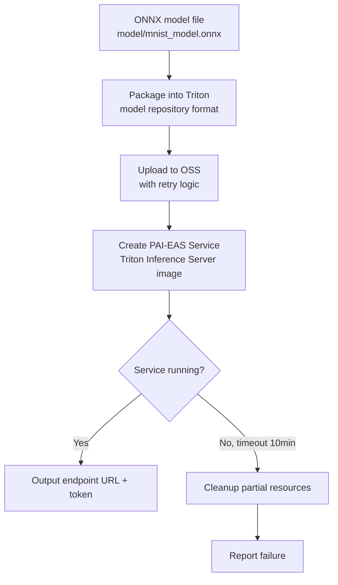
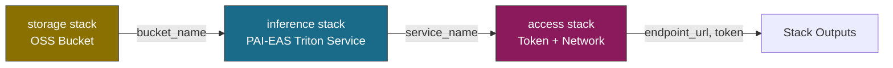
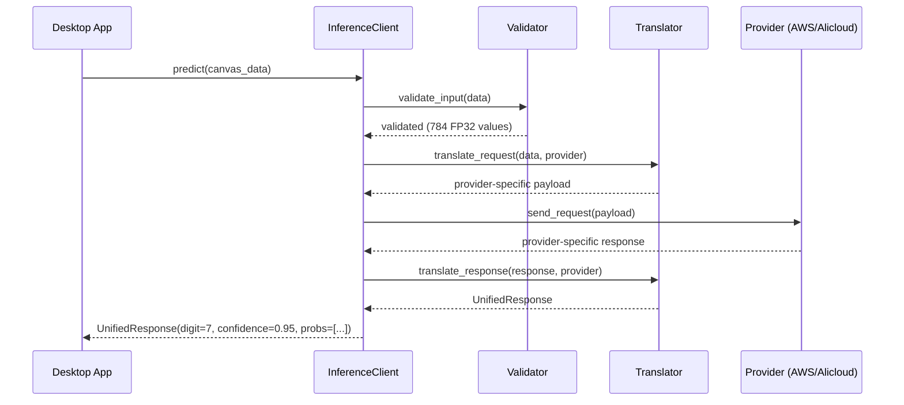
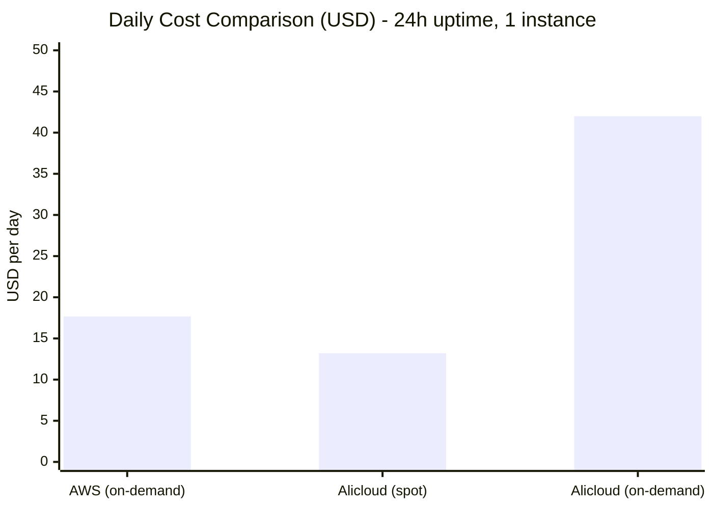

# Design Document: Multi-Cloud Inference

## Overview

This feature extends the existing AWS-only MNIST inference system to support multiple cloud providers - specifically adding Alibaba Cloud PAI-EAS as an alternative inference backend - and provides a cross-platform desktop application for unified interaction with both providers.

The system is organized into four layers:
- **Layer 1**: Alibaba Cloud deployment (PAI-EAS with ONNX model, IaC with ROS CDK)
- **Layer 2**: Unified inference client abstraction (provider-agnostic request/response)
- **Layer 3**: Desktop application with drawing canvas and provider switching
- **Layer 4**: Reliability and error handling across all components

### Target State Architecture


### Key Design Decisions

| Decision | Choice | Rationale |
|--------|--------|-----------|
| Alicloud IaC tool | ROS CDK (Python) | Same paradigm as AWS CDK; native Alibaba Cloud IaC; same construct-based patterns; ros-cdk destroy for cleanup |
| Alicloud serving backend | Triton Inference Server (PAI-EAS official image) | Same protocol as AWS SageMaker Triton; unified V2 client; dynamic batching support |
| Alicloud API layer | Direct PAI-EAS (no gateway) | PAI-EAS exposes public HTTPS with built-in token auth; simpler for test deployment |
| Desktop GUI framework | tkinter | Included in Python stdlib; cross-platform; no extra dependencies |
| Auth header (Alicloud) | Authorization header | PAI-EAS standard token auth mechanism |
| Auth header (AWS) | x-api-key | API Gateway API key mechanism (existing) |
| Credential storage | OS keychain (keyring library) | Secure storage without plaintext; cross-platform via python keyring |
| Spot instances | Alibaba Cloud only | PAI-EAS supports preemptible instances; SageMaker inference does not |
| Max replicas | 3 | Cost-optimized test deployment |
| Config file format | JSON | Simple, human-readable, easy to parse |
| Config file location | OS-standard config dir | XDG_CONFIG_HOME / %APPDATA% / ~/Library/Application Support |
| Provider switching | In-memory state change | No restart needed; instant switch with health check |

## Architecture

The system extends the existing project structure with new directories for Alibaba Cloud infrastructure, the unified inference client, and the desktop application.

### Project Structure (Extended)

```
infra_aws/                          # AWS CDK (existing, moved from infra/)
  cdk.json                          # CDK project config (moved from project root)
  app.py                            # CDK app entry point
  stacks/
    __init__.py
    storage_stack.py                # Stack 1: S3 bucket for model artifacts
    sagemaker_stack.py              # Stack 2: SageMaker Triton endpoint
    api_stack.py                    # Stack 3: API Gateway

infra_alicloud/                     # Alibaba Cloud ROS CDK (new)
  cdk.json                          # ROS CDK project configuration
  app.py                            # ROS CDK app entry point
  stacks/
    __init__.py
    storage_stack.py                # Stack 1: OSS bucket for model artifacts
    eas_stack.py                    # Stack 2: PAI-EAS Triton inference service
    access_stack.py                 # Stack 3: Auth & network config
  config.py                         # Alicloud deployment configuration

model/                              # Model artifacts and training
  train.py                          # Training script (existing)
  mnist_model.pt                    # PyTorch model (existing)
  mnist_model.onnx                  # ONNX model (existing)
  triton_repo/                      # Triton model repository (shared format, existing)
    mnist/
      config.pbtxt                  # Triton model configuration
      1/
        model.onnx                  # ONNX model file (version 1)

src/                                # Application code
  config.py                         # PackagerConfig (existing)
  exceptions.py                     # Pipeline exceptions (existing)
  model_packager.py                 # Model packaging (existing)
  inference/                        # Unified inference client (new)
    __init__.py
    client.py                       # InferenceClient class
    providers/
      __init__.py
      base.py                       # ProviderBackend ABC
      aws.py                        # AWSBackend (Triton V2 protocol)
      alicloud.py                   # AlicloudBackend (Triton V2 protocol)
    models.py                       # UnifiedResponse, ProviderConfig dataclasses
    errors.py                       # Provider-agnostic exceptions
    validation.py                   # Input validation logic
  app/                              # Desktop application (evolved from model/draw_digit.py)
    __init__.py
    main.py                         # App entry point (based on DigitCanvas class)
    provider_switcher.py            # Provider selection UI (new)
    settings_dialog.py              # Provider configuration UI (new)
    config_manager.py               # Persistent config with keyring (new)
    preprocessing.py                # Canvas to 28x28 normalization (extracted from DigitCanvas.preprocess)

scripts/                            # Utility and test scripts
  test_endpoint.py                  # Test invoke SageMaker endpoint (moved from main.py)
  package_model.py                  # Run model packaging pipeline (moved from project root)

tests/                              # Tests (extended)
  test_cdk_stacks.py               # CDK tests (existing)
  test_model_packager.py           # Packager tests (existing)
  test_inference_client.py         # Inference client unit tests (new)
  test_input_validation.py         # Input validation properties (new)
  test_response_normalization.py   # Response normalization properties (new)
  test_error_categorization.py     # Error handling properties (new)
  test_config_manager.py           # Config persistence tests (new)
  test_alicloud_deployer.py        # Alicloud deployment tests (new)
  test_preprocessing.py            # Canvas preprocessing properties (new)
```

### Layer 1 - Alibaba Cloud Deployment

#### Deployment Flow



#### Alibaba Cloud ROS CDK Stacks



### Layer 2 - Unified Inference Client



### Layer 3 - Desktop Application

```
Desktop App Wireframe:

┌─────────────────────────────────────────────────────────┐
│  MNIST Multi-Cloud Inference                      [⚙]   │
├─────────────────────────────────────────────────────────┤
│                                                         │
│  ┌───────────────────────────┐   Provider:              │
│  │                           │   ○ AWS        ● Online  │
│  │                           │   ● Alicloud   ● Online  │
│  │      (Draw digit here)    │                          │
│  │                           │   ─────────────────────  │
│  │                           │   Result:                │
│  │                           │   Predicted: 7           │
│  │        280 x 280 px       │   Confidence: 95.2%      │
│  │                           │   Provider: Alicloud     │
│  │                           │                          │
│  └───────────────────────────┘                          │
│                                                         │
│  [ Predict ]  [ Clear ]                                 │
│                                                         │
└─────────────────────────────────────────────────────────┘

User flow:
1. Draw a digit on the canvas (white strokes on black)
2. Select provider (AWS or Alicloud) with one click
3. Click "Predict" — image is resized to 28x28, normalized, sent to active provider
4. Result shows predicted digit, confidence %, and which provider answered
5. Click "Clear" to reset and draw again

[⚙] opens Settings dialog for configuring endpoint URLs and credentials.
```

## Cost Estimation

Daily running cost estimates for both cloud providers with 1 instance running, based on test deployment usage (low traffic, single replica).

### AWS (eu-west-1)

| Component | Pricing | Daily Cost (24h) | Daily Cost (8h) |
|-----------|---------|------------------|-----------------|
| SageMaker ml.g4dn.xlarge (on-demand) | $0.736/hr | ~$17.66 | ~$5.89 |
| API Gateway (low traffic, <1K req/day) | $3.50/1M requests | ~$0.01 | ~$0.01 |
| S3 (model artifact ~50MB) | $0.023/GB/month | ~$0.00 | ~$0.00 |
| **Total (AWS)** | | **~$17.67/day** | **~$5.90/day** |

> Note: SageMaker inference endpoints do not support spot instances. Cost is fixed on-demand pricing.

### Alibaba Cloud (cn-hangzhou)

| Component | Pricing | Daily Cost (24h) | Daily Cost (8h) |
|-----------|---------|------------------|-----------------|
| PAI-EAS ecs.gn6i-c4g1.xlarge (spot) | ~$0.40-0.70/hr (60-70% discount) | ~$9.60-16.80 | ~$3.20-5.60 |
| PAI-EAS ecs.gn6i-c4g1.xlarge (on-demand fallback) | ~$1.40-2.10/hr | ~$33.60-50.40 | ~$11.20-16.80 |
| OSS (model artifact ~50MB) | $0.02/GB/month | ~$0.00 | ~$0.00 |
| Network egress (minimal) | $0.11/GB | ~$0.00 | ~$0.00 |
| **Total (Alicloud, spot)** | | **~$9.60-16.80/day** | **~$3.20-5.60/day** |

### Side-by-Side Comparison



### Cost Summary

| Scenario | AWS | Alicloud (spot) | Savings with Alicloud |
|----------|-----|-----------------|----------------------|
| 24h/day (always on) | ~$17.67 | ~$13.20 | ~25% cheaper |
| 8h/day (dev hours only) | ~$5.90 | ~$4.40 | ~25% cheaper |
| Idle (scale to 0) | ~$0.01 (API GW only) | $0.00 | — |

### Cost Optimization Tips

- **Shut down when not testing**: Both providers charge per-hour for compute. Destroy endpoints overnight.
- **Alibaba Cloud advantage**: PAI-EAS supports scaling to 0 replicas (cold start ~30-60s). AWS SageMaker real-time endpoints cannot scale to 0.
- **Spot risk**: Alibaba spot instances can be reclaimed. For a test deployment this is acceptable (brief interruption, auto-recovery within 60s).
- **Monthly estimate**: If running 8h/day on weekdays only (~22 days/month):
  - AWS: ~$130/month
  - Alicloud (spot): ~$97/month
  - **Combined (both running)**: ~$227/month

> Prices are approximate and subject to change. Actual costs depend on region availability, spot market conditions, and traffic volume.

## Components and Interfaces

### Layer 1 Components

#### 1. Alicloud Deployer (`src/alicloud_deployer.py`)

Orchestrates model upload to OSS and PAI-EAS service creation. Uses the Alibaba Cloud Python SDK (alibabacloud-pai-eas-sdk).

```python
@dataclass
class AlicloudDeployConfig:
    """Configuration for Alibaba Cloud deployment."""
    model_path: str                         # Path to local ONNX model
    region: str = "cn-hangzhou"             # Alibaba Cloud region
    instance_type: str = "ecs.gn6i-c4g1.xlarge"  # GPU instance
    use_spot: bool = True                   # Use preemptible instances
    min_replicas: int = 1                   # Min auto-scaling replicas
    max_replicas: int = 3                   # Max auto-scaling replicas
    scaling_target_qps: int = 10            # Target QPS per instance
    oss_bucket: str = ""                    # OSS bucket name
    oss_prefix: str = "models/mnist/"       # OSS key prefix

ALLOWED_ALICLOUD_GPU_FAMILIES = [
    "ecs.gn6i", "ecs.gn6v", "ecs.gn7i", "ecs.gn7e",
]

VALID_ALICLOUD_REGIONS = [
    "cn-shanghai", "cn-beijing", "cn-hangzhou", "cn-shenzhen",
    "cn-guangzhou", "cn-chengdu", "cn-hongkong",
]

class AlicloudDeployer:
    """Deploys MNIST ONNX model to Alibaba Cloud PAI-EAS using Triton Inference Server."""

    def __init__(self, config: AlicloudDeployConfig): ...

    def validate_config(self) -> None:
        """Validate region, instance type, and scaling bounds.
        Raises: ConfigValidationError for invalid config."""

    def prepare_model_repository(self, model_path: Path) -> Path:
        """Package ONNX model into Triton model repository format.
        Creates structure:
          model_repository/
            mnist/
              config.pbtxt
              1/
                model.onnx
        Returns: Path to packaged model_repository directory."""

    def upload_to_oss(self, model_repo_path: Path) -> str:
        """Upload Triton model repository to OSS with retry (3 attempts, 1s delay).
        Returns: OSS URI.
        Raises: UploadError after 3 failed attempts."""

    def create_service(self, oss_uri: str) -> dict:
        """Create PAI-EAS Triton inference service using official Triton image.
        Returns: dict with endpoint_url and access_token.
        Raises: DeploymentError if service fails to reach running state."""

    def wait_for_service(self, service_name: str, timeout: int = 600) -> None:
        """Wait for service to reach running state.
        Raises: DeploymentError after timeout with cleanup."""

    def delete_service(self, service_name: str, cleanup_oss: bool = False) -> dict:
        """Delete PAI-EAS service and optionally OSS artifacts.
        Returns: Status summary dict."""

    def deploy(self) -> dict:
        """Full deployment pipeline. Returns endpoint info."""
```

#### 2. Alibaba Cloud Infrastructure - Storage Stack (`infra_alicloud/stacks/storage_stack.py`)

Provisions an OSS bucket for model artifacts, equivalent to AWS `StorageStack`.

```python
import ros_cdk_core as ros
import ros_cdk_oss as oss

class StorageStack(ros.Stack):
    """ROS CDK stack for OSS model artifact storage."""

    def __init__(self, scope: ros.Construct, id: str, **kwargs):
        """Creates OSS bucket with:
        - Server-side encryption (AES256)
        - Lifecycle rules for cost management
        """
        super().__init__(scope, id, **kwargs)

    # Exposed attributes for cross-stack reference
    bucket_name: str   # ROS Output
    bucket_arn: str    # ROS Output
```

#### 3. Alibaba Cloud Infrastructure - Inference Stack (`infra_alicloud/stacks/eas_stack.py`)

Provisions the PAI-EAS service, equivalent to AWS `SageMakerStack`.

```python
import ros_cdk_core as ros
import ros_cdk_pai as pai

class EasStack(ros.Stack):
    """ROS CDK stack for PAI-EAS Triton Inference Server service."""

    def __init__(self, scope: ros.Construct, id: str,
                 oss_bucket_name: str,
                 model_key: str,
                 instance_type: str = "ecs.gn6i-c4g1.xlarge",
                 use_spot: bool = True,
                 min_replicas: int = 1,
                 max_replicas: int = 3,
                 **kwargs):
        """Creates PAI-EAS service with:
        - Triton Inference Server (official PAI-EAS image)
        - ONNX model in Triton model repository format
        - GPU instance (preemptible by default)
        - Auto-scaling (QPS-based, max 3 replicas)
        - Triton V2 inference protocol endpoint
        """
        super().__init__(scope, id, **kwargs)

    # Exposed attributes for cross-stack reference
    service_name: str    # ROS Output
    endpoint_url: str    # ROS Output
```

#### 4. Alibaba Cloud Infrastructure - Access Stack (`infra_alicloud/stacks/access_stack.py`)

Configures authentication and network access, equivalent to AWS `ApiStack`.

```python
import ros_cdk_core as ros

class AccessStack(ros.Stack):
    """ROS CDK stack for PAI-EAS access configuration."""

    def __init__(self, scope: ros.Construct, id: str,
                 service_name: str,
                 **kwargs):
        """Configures:
        - Access token generation
        - Public HTTPS endpoint exposure
        - Network access policy (public for test deployment)
        """
        super().__init__(scope, id, **kwargs)

    # Exposed attributes
    access_token: str      # ROS Output
    public_endpoint: str   # ROS Output
```

### Layer 2 Components

#### 5. Provider Backend Interface (`src/inference/providers/base.py`)

Abstract base class defining the contract all provider backends must implement.

```python
from abc import ABC, abstractmethod
from src.inference.models import UnifiedResponse

class ProviderBackend(ABC):
    """Abstract interface for cloud inference providers."""

    @abstractmethod
    def send_request(self, pixel_data: list[float]) -> UnifiedResponse:
        """Send inference request with 784 FP32 values.
        Returns: UnifiedResponse with prediction.
        Raises: InferenceError on failure."""

    @abstractmethod
    def health_check(self, timeout: float = 5.0) -> bool:
        """Check if the provider endpoint is reachable.
        Returns: True if healthy, False otherwise."""

    @abstractmethod
    def provider_name(self) -> str:
        """Return human-readable provider identifier."""
```

#### 6. AWS Backend (`src/inference/providers/aws.py`)

Translates to Triton V2 protocol and sends via API Gateway with x-api-key.

```python
class AWSBackend(ProviderBackend):
    """AWS SageMaker backend via API Gateway with Triton V2 protocol."""

    def __init__(self, endpoint_url: str, api_key: str):
        """
        Args:
            endpoint_url: API Gateway invoke URL (e.g. https://xxx.execute-api.eu-west-1.amazonaws.com/prod/predict)
            api_key: API Gateway API key value
        """

    def send_request(self, pixel_data: list[float]) -> UnifiedResponse:
        """Translate 784 values to Triton V2 JSON, send with x-api-key header.
        Request format: {"inputs": [{"name": "input", "shape": [1,1,28,28], "datatype": "FP32", "data": [...]}]}
        Response parsing: outputs[0].data -> 10-element probability array"""

    def health_check(self, timeout: float = 5.0) -> bool:
        """Send OPTIONS or lightweight request to verify endpoint is reachable."""

    def provider_name(self) -> str:
        return "AWS"
```

#### 7. Alicloud Backend (`src/inference/providers/alicloud.py`)

Translates to PAI-EAS request format and sends with Authorization header.

```python
class AlicloudBackend(ProviderBackend):
    """Alibaba Cloud PAI-EAS backend running Triton Inference Server with token auth."""

    def __init__(self, endpoint_url: str, access_token: str):
        """
        Args:
            endpoint_url: PAI-EAS Triton service endpoint URL
            access_token: PAI-EAS access token for Authorization header
        """

    def send_request(self, pixel_data: list[float]) -> UnifiedResponse:
        """Translate 784 values to Triton V2 JSON (same format as AWS), send with Authorization header.
        Request format: {"inputs": [{"name": "input", "shape": [1,1,28,28], "datatype": "FP32", "data": [...]}]}
        Response parsing: outputs[0].data -> 10-element probability array"""

    def health_check(self, timeout: float = 5.0) -> bool:
        """Send GET to Triton health endpoint (/v2/health/ready)."""

    def provider_name(self) -> str:
        return "Alicloud"
```

#### 8. Inference Client (`src/inference/client.py`)

The main entry point for the desktop app. Handles input validation, format translation, and error categorization.

```python
class InferenceClient:
    """Unified inference client - provider-agnostic interface."""

    def __init__(self, provider: ProviderBackend):
        """Initialize with a specific provider backend."""

    @property
    def active_provider(self) -> str:
        """Name of the currently active provider."""

    def switch_provider(self, provider: ProviderBackend) -> None:
        """Switch to a different provider backend."""

    def predict(self, input_data: np.ndarray | list[float]) -> UnifiedResponse:
        """Validate input, translate to provider format, send, normalize response.
        Args:
            input_data: numpy array of shape (28,28), (1,28,28), or flat list of 784 floats.
                        Values must be in range 0.0-1.0.
        Returns: UnifiedResponse
        Raises: InputValidationError for invalid input
        Raises: InferenceError for provider failures"""

    def health_check(self) -> bool:
        """Check active provider health with 5s timeout."""
```

#### 9. Input Validator (`src/inference/validation.py`)

Pure validation logic, separated for testability.

```python
def validate_input(data: np.ndarray | list) -> list[float]:
    """Validate and normalize input to flat list of 784 FP32 values.
    Accepts:
      - numpy array shape (28, 28)
      - numpy array shape (1, 28, 28)
      - flat list/array of exactly 784 numeric values
    All values must be in range [0.0, 1.0].
    Returns: flat list of 784 floats.
    Raises: InputValidationError with descriptive message."""
```

#### 10. Error Categorizer (`src/inference/errors.py`)

Translates provider-specific errors into provider-agnostic categories.

```python
class ErrorCategory(Enum):
    AUTHENTICATION = "authentication"
    TIMEOUT = "timeout"
    NETWORK = "network"
    SERVER_ERROR = "server_error"
    VALIDATION = "validation"
    UNKNOWN = "unknown"

class InferenceError(Exception):
    """Provider-agnostic inference error."""
    category: ErrorCategory
    message: str
    # No provider-specific details exposed

def categorize_error(exception: Exception, status_code: int | None = None) -> InferenceError:
    """Categorize a provider error into a standard category.
    - 401/403 -> AUTHENTICATION
    - Timeout exceptions -> TIMEOUT
    - ConnectionError, DNS, TLS -> NETWORK
    - 5xx -> SERVER_ERROR
    - Everything else -> UNKNOWN"""
```

### Layer 3 Components

#### 11. Desktop App Main Window (`src/app/main.py`)

Main application window using tkinter. Evolved from `model/draw_digit.py` (DigitCanvas class) with added multi-provider support. Retains existing canvas drawing, preprocessing, and Triton V2 payload logic. Adds provider switching, configurable endpoints, and credential management.

```python
class MnistApp:
    """Main desktop application window (based on existing DigitCanvas from model/draw_digit.py).
    
    Reuses from draw_digit.py:
    - 280x280 canvas with white-on-black drawing (paint method)
    - PIL Image-based drawing with brush radius
    - 28x28 resize + normalize preprocessing
    - Triton V2 JSON payload construction
    - Predict/Clear buttons and keyboard shortcuts (Enter/Escape)
    
    Adds:
    - Provider switcher (radio buttons for AWS/Alicloud)
    - Configurable endpoint URL and auth headers
    - Settings dialog for managing providers
    - Health check status indicators
    - Error categorization and display
    """

    def __init__(self):
        """Initialize tkinter root, layout all widgets."""

    def on_predict(self) -> None:
        """Handle Predict button click:
        1. Check canvas is not blank
        2. Check provider is configured
        3. Preprocess canvas -> 28x28 normalized (existing logic)
        4. Build Triton V2 payload (existing logic)
        5. Send with provider-specific auth header
        6. Display result or categorized error"""

    def on_clear(self) -> None:
        """Reset canvas and results display (existing logic)."""

    def on_provider_switch(self, provider_id: str) -> None:
        """Switch active provider, run health check, update status."""

    def show_error(self, error: InferenceError) -> None:
        """Display categorized error message with action buttons."""

    def run(self) -> None:
        """Start tkinter main loop."""
```

#### 12. Preprocessing (`src/app/preprocessing.py`)

Extracted from `DigitCanvas.preprocess()` in `model/draw_digit.py` for reuse and testability.

```python
def preprocess_canvas(canvas_image: Image.Image, target_size: int = 28) -> list[float]:
    """Convert PIL canvas image to 784 normalized float values.
    Extracted from existing DigitCanvas.preprocess() method.
    Steps:
    1. Resize to 28x28 using PIL LANCZOS (existing logic)
    2. Convert to numpy float32 array
    3. Normalize pixel values to [0.0, 1.0] by dividing by 255.0
    4. Flatten to list of 784 floats
    Returns: list of 784 float values in range [0.0, 1.0]"""
```

#### 13. Provider Switcher (`src/app/provider_switcher.py`)

UI component for selecting and switching between providers.

```python
class ProviderSwitcher:
    """Radio button group for provider selection with status indicators."""

    def __init__(self, parent, on_switch: Callable[[str], None]):
        """Create radio buttons for each configured provider."""

    def update_status(self, provider_id: str, available: bool) -> None:
        """Update availability indicator for a provider."""

    def set_active(self, provider_id: str) -> None:
        """Highlight the active provider."""

    def refresh_providers(self, providers: list[dict]) -> None:
        """Rebuild provider list from current configuration."""
```

#### 14. Configuration Manager (`src/app/config_manager.py`)

Handles persistence of provider configurations with secure credential storage.

```python
class ConfigManager:
    """Manages provider configuration persistence."""

    CONFIG_FILENAME = "multi_cloud_inference.json"

    def __init__(self):
        """Determine OS-appropriate config directory."""

    def get_config_path(self) -> Path:
        """Return platform-specific config file path:
        - Linux: $XDG_CONFIG_HOME/mnist-inference/ or ~/.config/mnist-inference/
        - macOS: ~/Library/Application Support/mnist-inference/
        - Windows: %APPDATA%/mnist-inference/"""

    def load(self) -> dict[str, ProviderConfig]:
        """Load provider configs from JSON file.
        Credentials are loaded from OS keyring.
        Returns empty dict if file missing or invalid."""

    def save(self, configs: dict[str, ProviderConfig]) -> None:
        """Persist configs to JSON atomically (write temp, rename).
        Credentials stored in OS keyring, not in JSON file."""

    def store_credential(self, provider_id: str, credential: str) -> None:
        """Store credential in OS keychain via keyring library."""

    def get_credential(self, provider_id: str) -> str | None:
        """Retrieve credential from OS keychain."""

    def delete_credential(self, provider_id: str) -> None:
        """Remove credential from OS keychain."""
```

#### 15. Settings Dialog (`src/app/settings_dialog.py`)

Modal dialog for adding/editing provider configurations.

```python
class SettingsDialog:
    """Modal dialog for provider configuration management."""

    def __init__(self, parent, config_manager: ConfigManager):
        """Create dialog with provider list and edit form."""

    def add_provider(self, provider_type: str) -> None:
        """Show form for new provider (AWS or Alicloud)."""

    def edit_provider(self, provider_id: str) -> None:
        """Show form pre-filled with existing config."""

    def remove_provider(self, provider_id: str) -> None:
        """Remove provider config with confirmation."""

    def test_connection(self, config: ProviderConfig) -> tuple[bool, float]:
        """Test connectivity with 10s timeout. Returns (success, response_time_ms)."""

    def validate_url(self, url: str) -> bool:
        """Validate URL format. Returns False for malformed URLs."""

    def on_save(self) -> None:
        """Validate fields, persist config, close dialog."""
```

## Data Models

### UnifiedResponse

```python
@dataclass
class UnifiedResponse:
    """Normalized prediction result from any provider."""
    predicted_digit: int          # 0-9, argmax of probabilities
    confidence: float             # 0.0-1.0, max probability value
    probabilities: list[float]    # 10-element list, sums to ~1.0
    provider: str                 # "AWS" or "Alicloud"
    response_time_ms: float       # Round-trip time in milliseconds
```

### ProviderConfig

```python
@dataclass
class ProviderConfig:
    """Configuration for a single cloud provider."""
    provider_id: str              # "aws" or "alicloud"
    provider_type: str            # "aws" or "alicloud"
    display_name: str             # Human-readable name
    endpoint_url: str             # API endpoint URL (max 2048 chars)
    region: str                   # Provider region (max 64 chars)
    # credential stored in OS keyring, NOT in this object at rest
    credential_key: str           # Keyring lookup key for this provider's credential
```

### Configuration File Schema (JSON)

```json
{
  "version": 1,
  "providers": {
    "aws": {
      "provider_type": "aws",
      "display_name": "AWS SageMaker (eu-west-1)",
      "endpoint_url": "https://xxx.execute-api.eu-west-1.amazonaws.com/prod/predict",
      "region": "eu-west-1",
      "credential_key": "mnist-inference/aws"
    },
    "alicloud": {
      "provider_type": "alicloud",
      "display_name": "Alibaba Cloud PAI-EAS (cn-hangzhou)",
      "endpoint_url": "https://xxx.cn-hangzhou.pai-eas.aliyuncs.com/api/predict/mnist",
      "region": "cn-hangzhou",
      "credential_key": "mnist-inference/alicloud"
    }
  },
  "active_provider": "aws"
}
```

Credentials are stored separately in the OS keyring under the service name `mnist-inference` with keys like `mnist-inference/aws` and `mnist-inference/alicloud`.

### AlicloudDeployConfig

```python
@dataclass
class AlicloudDeployConfig:
    """Deployment configuration for Alibaba Cloud PAI-EAS."""
    model_path: str
    region: str = "cn-shanghai"
    instance_type: str = "ecs.gn6i-c4g1.xlarge"
    use_spot: bool = True
    min_replicas: int = 1
    max_replicas: int = 3
    scaling_target_qps: int = 10
    oss_bucket: str = ""
    oss_prefix: str = "models/mnist/"
```

### Deletion Status Summary

```python
@dataclass
class DeletionStatus:
    """Result of a service deletion operation."""
    service_id: str
    outcome: str                  # "succeeded", "failed", "not_found"
    resources_removed: list[str]  # List of deleted resource identifiers
    errors: list[str]             # List of error descriptions (empty on success)
```

### Request/Response Formats

#### AWS (Triton V2 - existing, unchanged)

Request:
```json
{
  "inputs": [{"name": "input", "shape": [1, 1, 28, 28], "datatype": "FP32", "data": [0.0, ...]}]
}
```

Response:
```json
{
  "outputs": [{"name": "output", "shape": [1, 10], "datatype": "FP32", "data": [0.01, ...]}]
}
```

Headers: `x-api-key: {api_key}`, `Content-Type: application/json`

#### Alibaba Cloud (Triton V2 via PAI-EAS)

Request:
```json
{
  "inputs": [{"name": "input", "shape": [1, 1, 28, 28], "datatype": "FP32", "data": [0.0, ...]}]
}
```

Response:
```json
{
  "outputs": [{"name": "output", "shape": [1, 10], "datatype": "FP32", "data": [0.01, ...]}]
}
```

Headers: `Authorization: {access_token}`, `Content-Type: application/json`

> Note: Both AWS and Alicloud use the same Triton V2 inference protocol. The only difference is the authentication mechanism (x-api-key vs Authorization token) and the endpoint URL.

### Error Log Entry Format

```json
{
  "timestamp": "2024-01-15T10:30:00.000Z",
  "provider": "aws",
  "endpoint_url": "https://xxx.execute-api.eu-west-1.amazonaws.com/prod/predict",
  "error_code": 503,
  "error_category": "server_error",
  "message": "Service temporarily unavailable"
}
```

Log file location:
- Linux: `$XDG_DATA_HOME/mnist-inference/inference.log` or `~/.local/share/mnist-inference/inference.log`
- macOS: `~/Library/Application Support/mnist-inference/inference.log`
- Windows: `%LOCALAPPDATA%/mnist-inference/inference.log`

## Correctness Properties

*A property is a characteristic or behavior that should hold true across all valid executions of a system - essentially, a formal statement about what the system should do. Properties serve as the bridge between human-readable specifications and machine-verifiable correctness guarantees.*

### Property 1: OSS upload retry behavior

*For any* sequence of upload attempts where the first N attempts fail (0 <= N <= 3), the deployer should retry with at least 1 second delay between attempts. If N < 3, the (N+1)th attempt should succeed and return a valid OSS URI. If all 3 attempts fail, the deployer should raise an UploadError.

**Validates: Requirements 1.6**

### Property 2: Alicloud instance type validation

*For any* instance type string, the validator should accept it if and only if it starts with one of the allowed Alibaba Cloud GPU families (ecs.gn6i, ecs.gn6v, ecs.gn7i, ecs.gn7e). All other instance families and unrecognized strings should be rejected with a descriptive error message indicating the type is not supported.

**Validates: Requirements 2.2, 2.4, 2.5**

### Property 3: Alicloud region validation

*For any* string, the region validator should accept it if and only if it belongs to the set of valid Alibaba Cloud regions. Invalid or unrecognized strings should be rejected with an error message indicating the region is not available.

**Validates: Requirements 2.1, 2.6**

### Property 4: Auto-scaling bounds validation

*For any* pair of integers (min_replicas, max_replicas), the configuration validator should accept the pair if and only if min_replicas >= 1, max_replicas <= 3, and min_replicas <= max_replicas. Invalid bounds should be rejected with an error indicating the invalid scaling configuration.

**Validates: Requirements 2.3, 2.7**

### Property 5: Inference client input validation

*For any* numpy array of shape (28, 28) or (1, 28, 28) or flat list of exactly 784 values, where all values are in range [0.0, 1.0], the input validator should accept it and return a flat list of 784 floats. For any input that violates shape requirements or contains out-of-range values, the validator should raise an InputValidationError with a message describing the expected vs actual format.

**Validates: Requirements 5.2, 5.8, 5.9**

### Property 6: Response normalization

*For any* valid provider response containing a 10-element probability array (non-negative values summing to approximately 1.0), the normalizer should produce a UnifiedResponse where predicted_digit equals the argmax of the array, confidence equals the maximum value, and probabilities is the full 10-element list.

**Validates: Requirements 5.3, 5.5**

### Property 7: Request format translation

*For any* valid flat list of 784 FP32 values in range [0.0, 1.0], both the AWS and Alicloud translators should produce a valid Triton V2 JSON payload with shape [1, 1, 28, 28] and datatype "FP32". The payloads should be structurally identical (same JSON schema), differing only in the authentication header used (x-api-key for AWS, Authorization for Alicloud). Both should preserve the exact input values.

**Validates: Requirements 5.4**

### Property 8: Error categorization

*For any* HTTP status code or exception type from a provider, the error categorizer should produce an InferenceError with the correct category: 401/403 maps to AUTHENTICATION, timeout exceptions map to TIMEOUT, connection errors (DNS, refused, reset, TLS) map to NETWORK, 5xx maps to SERVER_ERROR, and all others map to UNKNOWN. The resulting error message should never contain provider-specific endpoint URLs or tokens.

**Validates: Requirements 5.6, 10.1, 10.3, 10.4, 10.7**

### Property 9: Provider config serialization round-trip

*For any* valid ProviderConfig object (with valid provider_id, non-empty endpoint_url up to 2048 chars, non-empty region up to 64 chars, and valid credential_key), serializing it to JSON and deserializing should produce an equivalent ProviderConfig object.

**Validates: Requirements 6.1**

### Property 10: Canvas preprocessing invariant

*For any* canvas image (numpy array of arbitrary dimensions with values 0-255), the preprocessing function should always produce a flat list of exactly 784 float values, each in the range [0.0, 1.0].

**Validates: Requirements 7.3**

### Property 11: Deletion status summary structure

*For any* deletion operation result (success, failure, or not-found), the returned DeletionStatus should contain a non-empty service_id, an outcome from the set {"succeeded", "failed", "not_found"}, a resources_removed list (possibly empty), and an errors list (empty when outcome is "succeeded").

**Validates: Requirements 3.2, 3.5**

### Property 12: Error log entry completeness

*For any* inference error event, the log entry written to the log file should contain all required fields: provider name (non-empty string), endpoint URL (valid URL string), error code (integer or null), error category (valid ErrorCategory value), and timestamp in ISO 8601 format.

**Validates: Requirements 10.8**

### Property 13: URL format validation

*For any* string, the URL validator should accept it if and only if it conforms to a valid URL format (scheme://host with optional port and path). Strings without a scheme, without a host, or with invalid characters should be rejected.

**Validates: Requirements 9.7**

### Property 14: Provider form required fields validation

*For any* pair of (endpoint_url, credential) strings, the form validator should enable save if and only if both strings are non-empty after trimming whitespace. Pairs where either field is empty or whitespace-only should disable save.

**Validates: Requirements 6.6, 9.2, 9.3**

## Error Handling

### Alicloud Deployer Errors

| Error Scenario | Behavior |
|---|---|
| Invalid instance type (not in allowed GPU families) | Raise ConfigValidationError with allowed families list |
| Invalid region (not in valid regions list) | Raise ConfigValidationError with valid regions list |
| Invalid scaling bounds (min > max) | Raise ConfigValidationError indicating invalid bounds |
| OSS upload failure (transient) | Retry up to 3 times, 1s minimum delay between attempts |
| OSS upload failure (exhausted) | Raise UploadError with failure cause |
| PAI-EAS service creation failure | Raise DeploymentError with API error details |
| PAI-EAS service timeout (>10 min) | Cleanup partial resources, raise DeploymentError |
| Service deletion failure | Log service_id and reason, include in DeletionStatus.errors |
| OSS artifact deletion failure (cleanup=true) | Log OSS key and reason, include in DeletionStatus.errors |
| Service not found on deletion | Return DeletionStatus with outcome="not_found" |

### Inference Client Errors

| Error Scenario | Category | User-Facing Message |
|---|---|---|
| Input wrong shape | VALIDATION | "Expected 28x28 image or 784 values, got {actual_shape}" |
| Input out of range | VALIDATION | "Pixel values must be normalized to 0.0-1.0, found values in [{min}, {max}]" |
| Provider returns 401/403 | AUTHENTICATION | "Credentials are invalid or expired. Check provider configuration." |
| Request timeout (>10s for UI, >30s for client) | TIMEOUT | "Request timed out. The service may be unavailable." |
| Connection refused / DNS failure / TLS error | NETWORK | "Connection problem. Check your network connectivity." |
| Provider returns 5xx | SERVER_ERROR | "Service is temporarily unavailable." |
| Unknown error | UNKNOWN | "Request failed (error code: {code})." |

### Desktop App Error States

| State | UI Behavior |
|---|---|
| Canvas blank on Predict | Show inline message: "Draw a digit before predicting" |
| No provider configured | Show inline message: "Configure a provider in Settings" |
| Provider unreachable after switch | Show warning with "Retry" and "Switch Provider" buttons |
| Inference in progress | Disable Predict button, show loading spinner |
| Error received | Replace previous error, re-enable Predict button within 1s |
| Config file corrupt/missing | Start with empty config, prompt Settings dialog |

### Error Logging

All inference errors are logged to the platform-appropriate log file with the following fields:
- ISO 8601 timestamp
- Provider name
- Endpoint URL
- HTTP error code (if available)
- Error category
- Error message

Log rotation is not required for this test deployment.

## Testing Strategy

### Property-Based Tests

Property-based tests use [Hypothesis](https://hypothesis.readthedocs.io/) (already in dev dependencies) to validate universal correctness guarantees. Each property test runs a minimum of 100 iterations.

| Property | Test File | What Varies |
|----------|-----------|-------------|
| P1: OSS upload retry | test_alicloud_deployer.py | Failure sequence length (0-4) |
| P2: Instance type validation | test_alicloud_deployer.py | Random instance type strings |
| P3: Region validation | test_alicloud_deployer.py | Random region strings |
| P4: Scaling bounds validation | test_alicloud_deployer.py | Random (min, max) integer pairs |
| P5: Input validation | test_input_validation.py | Random arrays (valid/invalid shapes, values) |
| P6: Response normalization | test_response_normalization.py | Random 10-element probability arrays |
| P7: Request format translation | test_inference_client.py | Random 784-element float arrays |
| P8: Error categorization | test_error_categorization.py | Random status codes, exception types |
| P9: Config round-trip | test_config_manager.py | Random ProviderConfig objects |
| P10: Canvas preprocessing | test_preprocessing.py | Random images (various sizes, pixel values) |
| P11: Deletion status structure | test_alicloud_deployer.py | Random deletion outcomes |
| P12: Error log completeness | test_error_categorization.py | Random inference errors |
| P13: URL validation | test_config_manager.py | Random strings (valid URLs, garbage) |
| P14: Form field validation | test_config_manager.py | Random (url, credential) string pairs |

Tag format: **Feature: multi-cloud-inference, Property {N}: {description}**

### Unit Tests (Example-Based)

Unit tests cover specific scenarios, edge cases, and integration points:

**Alicloud Deployer:**
- Successful deployment flow (mocked OSS + PAI-EAS API)
- Service timeout triggers cleanup
- Deployment output contains URL and token
- Preemptible fallback to on-demand (mocked)

**Inference Client:**
- Health check returns true/false based on mocked response
- Provider switch updates active_provider immediately
- In-flight request completes on original provider after switch

**Desktop App:**
- Clear button resets canvas and results
- Blank canvas detection prevents inference
- No-provider state disables Predict
- Error display replaces previous error
- Loading state disables Predict button

**Configuration:**
- Missing config file starts empty
- Corrupt JSON file starts empty
- Atomic write (temp file + rename)
- Credential stored in keyring, not JSON

### Integration Tests

Integration tests verify cross-service behavior:

**Alibaba Cloud (mocked with responses library or localstack equivalent):**
- OSS upload with correct bucket/prefix
- PAI-EAS service creation API call format
- PAI-EAS service deletion API call

**AWS (existing, extended):**
- CDK synthesis produces valid CloudFormation template
- API Gateway integration configuration correct in template

**ROS CDK (unit tests with assertions):**
- Storage stack synthesizes ROS template with encrypted OSS bucket
- EAS stack synthesizes ROS template with correct PAI-EAS service config
- Access stack outputs endpoint URL and token
- Cross-stack references are correctly wired

### Smoke Tests

- Alicloud PAI-EAS endpoint responds to valid request
- AWS API Gateway endpoint responds to valid request
- Desktop app launches without error on target platform
- Provider health check returns within 5 seconds
- Config file persists across app restart
- Credentials retrievable from OS keyring
