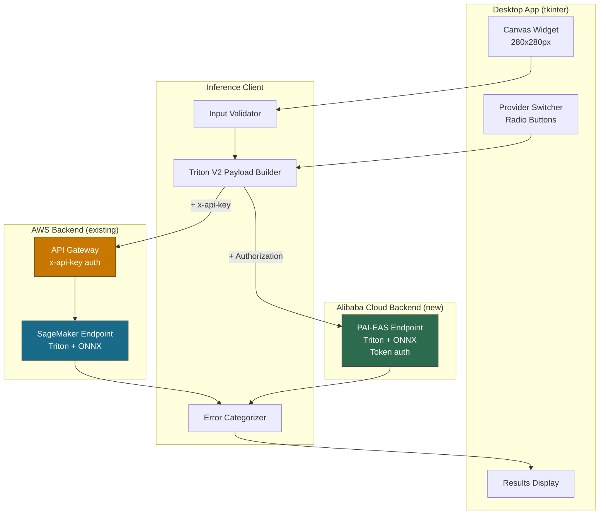
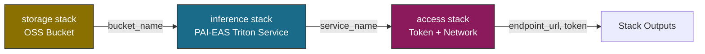
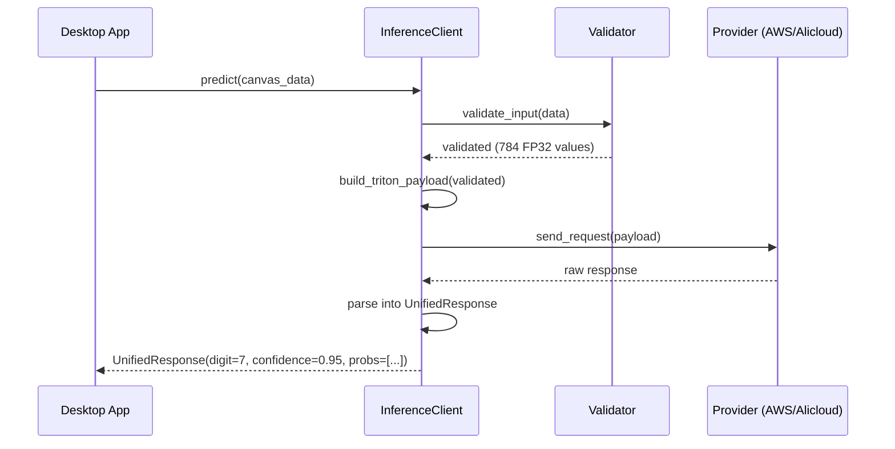
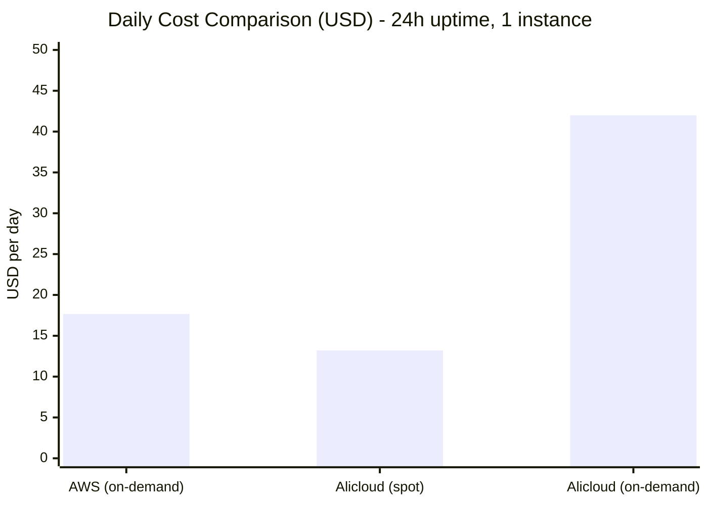

# Design Document: Multi-Cloud Inference

## Overview

This feature extends the existing AWS-only MNIST inference system to support multiple cloud providers - specifically adding Alibaba Cloud PAI-EAS as an alternative inference backend - and provides a cross-platform desktop application for unified interaction with both providers.

The system is organized into four layers:
- **Layer 1**: Alibaba Cloud deployment (PAI-EAS with ONNX model, IaC with ROS CDK)
- **Layer 2**: Unified inference client abstraction (provider-agnostic request/response)
- **Layer 3**: Desktop application with drawing canvas and provider switching
- **Layer 4**: Reliability and error handling across all components

### Target State Architecture



### Key Design Decisions

| Decision | Choice | Rationale |
|--------|--------|-----------|
| Alicloud IaC tool | ROS CDK (Python) | Same paradigm as AWS CDK; native Alibaba Cloud IaC; same construct-based patterns; ros-cdk destroy for cleanup |
| Alicloud serving backend | Triton Inference Server (PAI-EAS official image) | Same protocol as AWS SageMaker Triton; unified V2 client; dynamic batching support |
| Alicloud API layer | Direct PAI-EAS (no gateway) | PAI-EAS exposes public HTTPS with built-in token auth; simpler for test deployment |
| Desktop GUI framework | tkinter | Included in Python stdlib; cross-platform; no extra dependencies |
| Auth header (Alicloud) | Authorization header | PAI-EAS standard token auth mechanism |
| Auth header (AWS) | x-api-key | API Gateway API key mechanism (existing) |
| Credential storage | OS keychain (keyring library) | Secure storage without plaintext; cross-platform via python keyring |
| Spot instances | Alibaba Cloud only | PAI-EAS supports preemptible instances; SageMaker inference does not |
| Max replicas | 3 | Cost-optimized test deployment |
| Config file format | JSON | Simple, human-readable, easy to parse |
| Config file location | OS-standard config dir | XDG_CONFIG_HOME / %APPDATA% / ~/Library/Application Support |
| Provider switching | In-memory state change | No restart needed; instant switch with health check |
| Payload format | Shared Triton V2 builder | Both providers use identical payload; only URL and auth header differ |

## Architecture

The system extends the existing project structure with new directories for Alibaba Cloud infrastructure, the unified inference client, and the desktop application.

### Project Structure (Extended)

```
infra_aws/                          # AWS CDK (existing, moved from infra/)
  cdk.json                          # CDK project config (moved from project root)
  app.py                            # CDK app entry point
  stacks/
    __init__.py
    storage_stack.py                # Stack 1: S3 bucket for model artifacts
    sagemaker_stack.py              # Stack 2: SageMaker Triton endpoint
    api_stack.py                    # Stack 3: API Gateway

infra_alicloud/                     # Alibaba Cloud ROS CDK (new)
  cdk.json                          # ROS CDK project configuration
  app.py                            # ROS CDK app entry point
  stacks/
    __init__.py
    storage_stack.py                # Stack 1: OSS bucket for model artifacts
    eas_stack.py                    # Stack 2: PAI-EAS Triton inference service
    access_stack.py                 # Stack 3: Auth & network config
  config.py                         # Alicloud deployment configuration

model/                              # Model artifacts and training
  train.py                          # Training script (existing)
  mnist_model.pt                    # PyTorch model (existing)
  mnist_model.onnx                  # ONNX model (existing)
  triton_repo/                      # Triton model repository (shared format, existing)
    mnist/
      config.pbtxt                  # Triton model configuration
      1/
        model.onnx                  # ONNX model file (version 1)

src/                                # Application code
  config.py                         # PackagerConfig (existing)
  exceptions.py                     # Pipeline exceptions (existing)
  model_packager.py                 # Model packaging (existing)
  inference/                        # Unified inference client (new)
    __init__.py
    client.py                       # InferenceClient class
    payload.py                      # Shared Triton V2 payload builder
    providers/
      __init__.py
      base.py                       # ProviderBackend ABC
      aws.py                        # AWSBackend (Triton V2 protocol)
      alicloud.py                   # AlicloudBackend (Triton V2 protocol)
    models.py                       # UnifiedResponse, ProviderConfig dataclasses
    errors.py                       # Provider-agnostic exceptions
    validation.py                   # Input validation logic
  app/                              # Desktop application (evolved from model/draw_digit.py)
    __init__.py
    main.py                         # App entry point (based on DigitCanvas class)
    provider_switcher.py            # Provider selection UI (new)
    settings_dialog.py              # Provider configuration UI (new)
    config_manager.py               # Persistent config with keyring (new)
    preprocessing.py                # Canvas to 28x28 normalization (extracted from DigitCanvas.preprocess)

scripts/                            # Utility and test scripts
  test_endpoint.py                  # Test invoke SageMaker endpoint (moved from main.py)
  package_model.py                  # Run model packaging pipeline (moved from project root)

tests/                              # Tests (extended)
  test_cdk_stacks.py               # CDK tests (existing)
  test_model_packager.py           # Packager tests (existing)
  test_inference_client.py         # Inference client unit tests (new)
  test_input_validation.py         # Input validation properties (new)
  test_response_normalization.py   # Response normalization properties (new)
  test_error_categorization.py     # Error handling properties (new)
  test_config_manager.py           # Config persistence tests (new)
  test_preprocessing.py            # Canvas preprocessing properties (new)
```

### Layer 1 - Alibaba Cloud Deployment

#### Alibaba Cloud ROS CDK Stacks



### Layer 2 - Unified Inference Client



### Layer 3 - Desktop Application

```
Desktop App Wireframe:

┌─────────────────────────────────────────────────────────┐
│  MNIST Multi-Cloud Inference                      [⚙]   │
├─────────────────────────────────────────────────────────┤
│                                                         │
│  ┌───────────────────────────┐   Provider:              │
│  │                           │   ○ AWS        ● Online  │
│  │                           │   ● Alicloud   ● Online  │
│  │      (Draw digit here)    │                          │
│  │                           │   ─────────────────────  │
│  │                           │   Result:                │
│  │                           │   Predicted: 7           │
│  │        280 x 280 px       │   Confidence: 95.2%      │
│  │                           │   Provider: Alicloud     │
│  │                           │                          │
│  └───────────────────────────┘                          │
│                                                         │
│  [ Predict ]  [ Clear ]                                 │
│                                                         │
└─────────────────────────────────────────────────────────┘

User flow:
1. Draw a digit on the canvas (white strokes on black)
2. Select provider (AWS or Alicloud) with one click
3. Click "Predict" - image is resized to 28x28, normalized, sent to active provider
4. Result shows predicted digit, confidence %, and which provider answered
5. Click "Clear" to reset and draw again

[⚙] opens Settings dialog for configuring endpoint URLs and credentials.
```

## Cost Estimation

Daily running cost estimates for both cloud providers with 1 instance running, based on test deployment usage (low traffic, single replica).

### AWS (eu-west-1)

| Component | Pricing | Daily Cost (24h) | Daily Cost (8h) |
|-----------|---------|------------------|-----------------|
| SageMaker ml.g4dn.xlarge (on-demand) | $0.736/hr | ~$17.66 | ~$5.89 |
| API Gateway (low traffic, <1K req/day) | $3.50/1M requests | ~$0.01 | ~$0.01 |
| S3 (model artifact ~50MB) | $0.023/GB/month | ~$0.00 | ~$0.00 |
| **Total (AWS)** | | **~$17.67/day** | **~$5.90/day** |

> Note: SageMaker inference endpoints do not support spot instances. Cost is fixed on-demand pricing.

### Alibaba Cloud (cn-hangzhou)

| Component | Pricing | Daily Cost (24h) | Daily Cost (8h) |
|-----------|---------|------------------|-----------------|
| PAI-EAS ecs.gn6i-c4g1.xlarge (spot) | ~$0.40-0.70/hr (60-70% discount) | ~$9.60-16.80 | ~$3.20-5.60 |
| PAI-EAS ecs.gn6i-c4g1.xlarge (on-demand fallback) | ~$1.40-2.10/hr | ~$33.60-50.40 | ~$11.20-16.80 |
| OSS (model artifact ~50MB) | $0.02/GB/month | ~$0.00 | ~$0.00 |
| Network egress (minimal) | $0.11/GB | ~$0.00 | ~$0.00 |
| **Total (Alicloud, spot)** | | **~$9.60-16.80/day** | **~$3.20-5.60/day** |

### Side-by-Side Comparison



### Cost Summary

| Scenario | AWS | Alicloud (spot) | Savings with Alicloud |
|----------|-----|-----------------|----------------------|
| 24h/day (always on) | ~$17.67 | ~$13.20 | ~25% cheaper |
| 8h/day (dev hours only) | ~$5.90 | ~$4.40 | ~25% cheaper |
| Idle (scale to 0) | ~$0.01 (API GW only) | $0.00 | - |

### Cost Optimization Tips

- **Shut down when not testing**: Both providers charge per-hour for compute. Destroy endpoints overnight.
- **Alibaba Cloud advantage**: PAI-EAS supports scaling to 0 replicas (cold start ~30-60s). AWS SageMaker real-time endpoints cannot scale to 0.
- **Spot risk**: Alibaba spot instances can be reclaimed. For a test deployment this is acceptable (brief interruption, auto-recovery within 60s).
- **Monthly estimate**: If running 8h/day on weekdays only (~22 days/month):
  - AWS: ~$130/month
  - Alicloud (spot): ~$97/month
  - **Combined (both running)**: ~$227/month

> Prices are approximate and subject to change. Actual costs depend on region availability, spot market conditions, and traffic volume.

## Components and Interfaces

### Layer 1 Components

#### 1. Alibaba Cloud Infrastructure - Storage Stack (`infra_alicloud/stacks/storage_stack.py`)

Provisions an OSS bucket for model artifacts, equivalent to AWS `StorageStack`.

```python
import ros_cdk_core as ros
import ros_cdk_oss as oss

class StorageStack(ros.Stack):
    """ROS CDK stack for OSS model artifact storage."""

    def __init__(self, scope: ros.Construct, id: str, **kwargs):
        """Creates OSS bucket with:
        - Server-side encryption (AES256)
        - Lifecycle rules for cost management
        """
        super().__init__(scope, id, **kwargs)

    # Exposed attributes for cross-stack reference
    bucket_name: str   # ROS Output
    bucket_arn: str    # ROS Output
```

#### 2. Alibaba Cloud Infrastructure - Inference Stack (`infra_alicloud/stacks/eas_stack.py`)

Provisions the PAI-EAS service, equivalent to AWS `SageMakerStack`.

```python
import ros_cdk_core as ros
import ros_cdk_pai as pai

class EasStack(ros.Stack):
    """ROS CDK stack for PAI-EAS Triton Inference Server service."""

    def __init__(self, scope: ros.Construct, id: str,
                 oss_bucket_name: str,
                 model_key: str,
                 instance_type: str = "ecs.gn6i-c4g1.xlarge",
                 use_spot: bool = True,
                 min_replicas: int = 1,
                 max_replicas: int = 3,
                 **kwargs):
        """Creates PAI-EAS service with:
        - Triton Inference Server (official PAI-EAS image)
        - ONNX model in Triton model repository format
        - GPU instance (preemptible by default)
        - Auto-scaling (QPS-based, max 3 replicas)
        - Triton V2 inference protocol endpoint
        """
        super().__init__(scope, id, **kwargs)

    # Exposed attributes for cross-stack reference
    service_name: str    # ROS Output
    endpoint_url: str    # ROS Output
```

#### 3. Alibaba Cloud Infrastructure - Access Stack (`infra_alicloud/stacks/access_stack.py`)

Configures authentication and network access, equivalent to AWS `ApiStack`.

```python
import ros_cdk_core as ros

class AccessStack(ros.Stack):
    """ROS CDK stack for PAI-EAS access configuration."""

    def __init__(self, scope: ros.Construct, id: str,
                 service_name: str,
                 **kwargs):
        """Configures:
        - Access token generation
        - Public HTTPS endpoint exposure
        - Network access policy (public for test deployment)
        """
        super().__init__(scope, id, **kwargs)

    # Exposed attributes
    access_token: str      # ROS Output
    public_endpoint: str   # ROS Output
```

### Layer 2 Components

#### 4. Provider Backend Interface (`src/inference/providers/base.py`)

Abstract base class defining the contract all provider backends must implement.

```python
from abc import ABC, abstractmethod
from src.inference.models import UnifiedResponse

class ProviderBackend(ABC):
    """Abstract interface for cloud inference providers."""

    @abstractmethod
    def send_request(self, payload: dict) -> UnifiedResponse:
        """Send pre-built Triton V2 payload with provider-specific auth header.
        Returns: UnifiedResponse with prediction.
        Raises: InferenceError on failure."""

    @abstractmethod
    def health_check(self, timeout: float = 5.0) -> bool:
        """Check if the provider endpoint is reachable.
        Returns: True if healthy, False otherwise."""

    @abstractmethod
    def provider_name(self) -> str:
        """Return human-readable provider identifier."""
```

#### 5. Triton V2 Payload Builder (`src/inference/payload.py`)

Shared utility that builds the Triton V2 inference request payload. Both providers use identical payload format - only the URL and auth header differ.

```python
def build_triton_payload(pixel_data: list[float]) -> dict:
    """Build Triton V2 inference request JSON.
    
    Both AWS and Alicloud use identical payload format.
    Only the URL and auth header differ between providers.
    
    Args:
        pixel_data: Flat list of 784 FP32 values in [0.0, 1.0]
    
    Returns:
        dict ready for json serialization:
        {"inputs": [{"name": "input", "shape": [1, 1, 28, 28], "datatype": "FP32", "data": pixel_data}]}
    """
```

#### 6. AWS Backend (`src/inference/providers/aws.py`)

Calls `build_triton_payload()` and sends via API Gateway with x-api-key header.

```python
class AWSBackend(ProviderBackend):
    """AWS SageMaker backend via API Gateway with Triton V2 protocol."""

    def __init__(self, endpoint_url: str, api_key: str):
        """
        Args:
            endpoint_url: API Gateway invoke URL (e.g. https://xxx.execute-api.eu-west-1.amazonaws.com/prod/predict)
            api_key: API Gateway API key value
        """

    def send_request(self, payload: dict) -> UnifiedResponse:
        """Build payload via build_triton_payload(), send with x-api-key header.
        Response parsing: outputs[0].data -> 10-element probability array"""

    def health_check(self, timeout: float = 5.0) -> bool:
        """Send OPTIONS or lightweight request to verify endpoint is reachable."""

    def provider_name(self) -> str:
        return "AWS"
```

#### 7. Alicloud Backend (`src/inference/providers/alicloud.py`)

Calls `build_triton_payload()` and sends with Authorization header.

```python
class AlicloudBackend(ProviderBackend):
    """Alibaba Cloud PAI-EAS backend running Triton Inference Server with token auth."""

    def __init__(self, endpoint_url: str, access_token: str):
        """
        Args:
            endpoint_url: PAI-EAS Triton service endpoint URL
            access_token: PAI-EAS access token for Authorization header
        """

    def send_request(self, payload: dict) -> UnifiedResponse:
        """Build payload via build_triton_payload(), send with Authorization header.
        Response parsing: outputs[0].data -> 10-element probability array"""

    def health_check(self, timeout: float = 5.0) -> bool:
        """Send GET to Triton health endpoint (/v2/health/ready)."""

    def provider_name(self) -> str:
        return "Alicloud"
```

#### 8. Inference Client (`src/inference/client.py`)

The main entry point for the desktop app. Handles input validation, payload construction, and error categorization.

```python
class InferenceClient:
    """Unified inference client - provider-agnostic interface."""

    def __init__(self, provider: ProviderBackend):
        """Initialize with a specific provider backend."""

    @property
    def active_provider(self) -> str:
        """Name of the currently active provider."""

    def switch_provider(self, provider: ProviderBackend) -> None:
        """Switch to a different provider backend."""

    def predict(self, input_data: np.ndarray | list[float]) -> UnifiedResponse:
        """Validate input, build Triton V2 payload, send via active provider, parse response.
        Args:
            input_data: numpy array of shape (28,28), (1,28,28), or flat list of 784 floats.
                        Values must be in range 0.0-1.0.
        Returns: UnifiedResponse
        Raises: InputValidationError for invalid input
        Raises: InferenceError for provider failures"""

    def health_check(self) -> bool:
        """Check active provider health with 5s timeout."""
```
