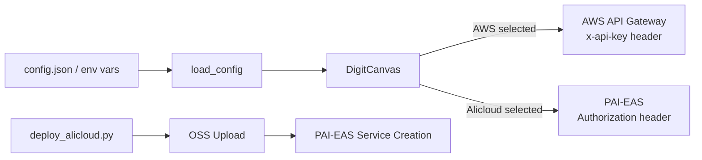

# Design Document: Multi-Cloud Minimal

## Overview

Minimal extension to the existing MNIST DigitCanvas app for multi-cloud inference. The design adds three small components: a config loader function, UI radio buttons with dynamic dispatch in DigitCanvas, and a standalone Alicloud deploy script. Total new code is ~100-200 lines with no abstractions beyond simple if/else branching.

## Architecture



The architecture is flat - no layers, no factories. `load_config()` returns a dict, DigitCanvas reads it at startup, and an if/else in `predict()` picks the right URL and header.

## Components and Interfaces

### 1. Config Loader (`src/app/config.py`)

A single function, no classes:

```python
import json
import os
from pathlib import Path

def load_config() -> dict:
    """Load provider config from config.json or fall back to env vars.
    
    Returns:
        {"aws": {"url": "...", "key": "..."}, "alicloud": {"url": "...", "key": "..."}}
    """
    config_path = Path(__file__).resolve().parents[2] / "config.json"
    
    if config_path.exists():
        try:
            with open(config_path) as f:
                data = json.load(f)
            return {
                "aws": {
                    "url": data.get("aws", {}).get("url", ""),
                    "key": data.get("aws", {}).get("key", ""),
                },
                "alicloud": {
                    "url": data.get("alicloud", {}).get("url", ""),
                    "key": data.get("alicloud", {}).get("key", ""),
                },
            }
        except (json.JSONDecodeError, KeyError):
            pass  # Fall through to env vars
    
    return {
        "aws": {
            "url": os.environ.get("AWS_ENDPOINT_URL", ""),
            "key": os.environ.get("AWS_API_KEY", ""),
        },
        "alicloud": {
            "url": os.environ.get("ALICLOUD_ENDPOINT_URL", ""),
            "key": os.environ.get("ALICLOUD_API_TOKEN", ""),
        },
    }
```

### 2. Modified DigitCanvas (`src/app/main.py`)

Changes to the existing class:

- Import `load_config` from `src/app/config.py`
- Remove the global `TRITON_URL` constant
- Add `self.config = load_config()` in `__init__`
- Add a `tk.StringVar` for provider selection and radio buttons in the UI
- Default selection: first provider with a non-empty URL
- In `predict()`, use if/else to pick URL and construct headers:

```python
# In predict():
provider = self.provider_var.get()  # "aws" or "alicloud"
url = self.config[provider]["url"]
key = self.config[provider]["key"]

if provider == "aws":
    headers = {"x-api-key": key}
else:
    headers = {"Authorization": key}

response = requests.post(url, json=payload, headers=headers, timeout=10)
```

UI addition (in `__init__`, after button_frame):

```python
provider_frame = tk.Frame(self.root)
provider_frame.pack(pady=5)

self.provider_var = tk.StringVar(value=self._default_provider())

tk.Radiobutton(provider_frame, text="AWS", variable=self.provider_var, value="aws").pack(side=tk.LEFT)
tk.Radiobutton(provider_frame, text="Alicloud", variable=self.provider_var, value="alicloud").pack(side=tk.LEFT)
```

Helper method:

```python
def _default_provider(self) -> str:
    """Return first provider with a configured URL, or 'aws' as fallback."""
    if self.config["aws"]["url"]:
        return "aws"
    if self.config["alicloud"]["url"]:
        return "alicloud"
    return "aws"
```

### 3. Deploy Script (`scripts/deploy_alicloud.py`)

Standalone script using `oss2` and `alibabacloud_pai_eas20210701` SDKs:

```python
"""Deploy ONNX model to Alibaba Cloud PAI-EAS as a Triton service."""

import argparse
import os
import sys

import oss2
from alibabacloud_pai_eas20210701.client import Client
from alibabacloud_tea_openapi.models import Config

def parse_args():
    parser = argparse.ArgumentParser(description="Deploy MNIST model to PAI-EAS")
    parser.add_argument("--model-path", default=os.environ.get("MODEL_PATH", "model_repository/"))
    parser.add_argument("--bucket", default=os.environ.get("OSS_BUCKET"))
    parser.add_argument("--oss-key", default=os.environ.get("OSS_KEY", "models/mnist/"))
    parser.add_argument("--region", default=os.environ.get("ALICLOUD_REGION", "cn-hangzhou"))
    parser.add_argument("--service-name", default=os.environ.get("SERVICE_NAME", "mnist_triton"))
    parser.add_argument("--instance-type", default=os.environ.get("INSTANCE_TYPE", "ecs.c6.large"))
    return parser.parse_args()

def upload_to_oss(args, access_key_id, access_key_secret):
    """Upload model files to OSS bucket."""
    auth = oss2.Auth(access_key_id, access_key_secret)
    bucket = oss2.Bucket(auth, f"https://oss-{args.region}.aliyuncs.com", args.bucket)
    # Upload model directory contents...

def create_eas_service(args, access_key_id, access_key_secret):
    """Create PAI-EAS Triton inference service."""
    config = Config(
        access_key_id=access_key_id,
        access_key_secret=access_key_secret,
        region_id=args.region,
    )
    client = Client(config)
    # Create service with Triton processor...
    # Return endpoint URL and token

def main():
    args = parse_args()
    access_key_id = os.environ.get("ALIBABA_CLOUD_ACCESS_KEY_ID")
    access_key_secret = os.environ.get("ALIBABA_CLOUD_ACCESS_KEY_SECRET")
    
    if not access_key_id or not access_key_secret:
        print("Error: ALIBABA_CLOUD_ACCESS_KEY_ID and ALIBABA_CLOUD_ACCESS_KEY_SECRET required")
        sys.exit(1)
    
    upload_to_oss(args, access_key_id, access_key_secret)
    endpoint, token = create_eas_service(args, access_key_id, access_key_secret)
    
    print(f"Endpoint: {endpoint}")
    print(f"Token: {token}")
```

## Data Models

No new data models. The config is a plain dict:

```python
{
    "aws": {"url": str, "key": str},
    "alicloud": {"url": str, "key": str}
}
```

The Triton V2 JSON payload format is unchanged from the existing code.

## Error Handling

| Scenario | Handling |
|----------|----------|
| `config.json` missing | Fall back to env vars silently |
| `config.json` malformed JSON | Fall back to env vars silently |
| Provider URL empty at predict time | Show "No endpoint configured for {provider}" in result label |
| HTTP timeout/connection error | Show "Error: Cannot connect to {provider} endpoint" in result label |
| HTTP non-2xx response | Show "Error: {status_code} from {provider}" in result label |
| Deploy script missing credentials | Print error, exit code 1 |
| Deploy script OSS upload failure | Print error, exit code 1 |
| Deploy script EAS creation failure | Print error, exit code 1 |

## Testing Strategy

No property-based testing - this feature is primarily UI wiring and cloud deployment configuration.

**Manual testing approach:**
- Draw a digit, select AWS, click Predict - verify correct header sent
- Switch to Alicloud, click Predict - verify correct header sent
- Remove config.json, set env vars - verify fallback works
- Run deploy script with valid credentials against PAI-EAS

**Future automated tests (out of scope for this minimal iteration):**
- Unit test `load_config()` with temp files and mocked env vars
- Integration test the full predict flow with a mock HTTP server
