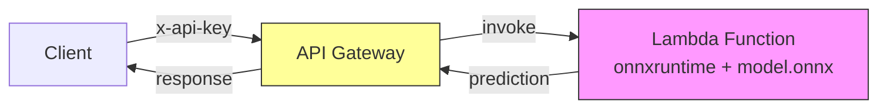
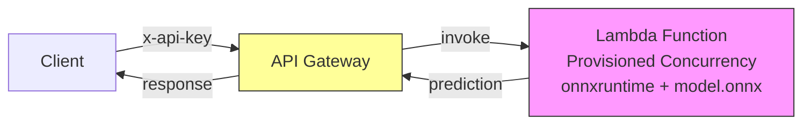
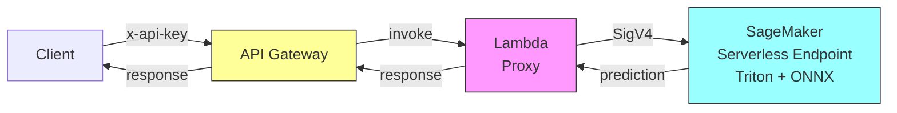
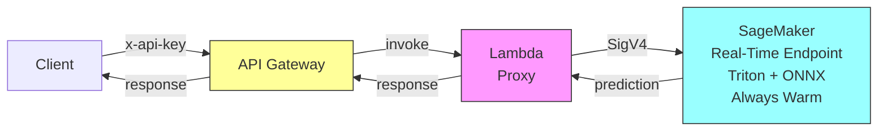
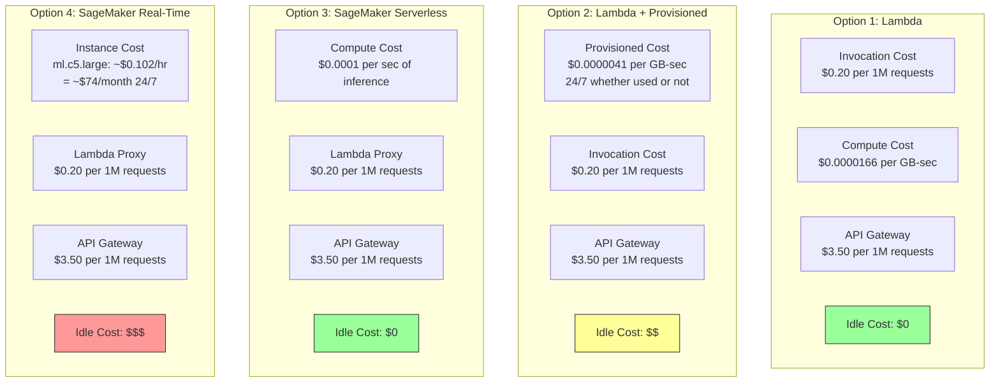
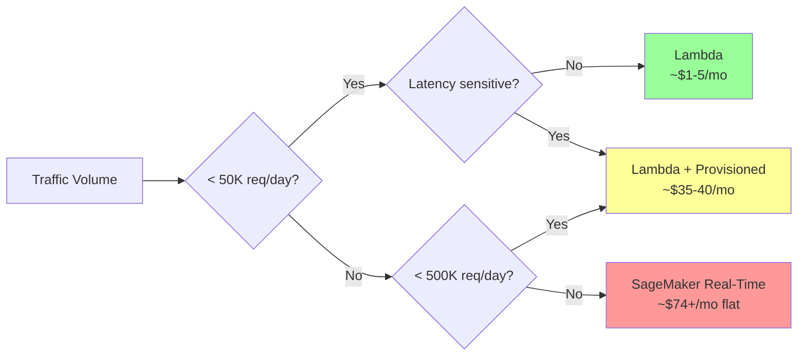
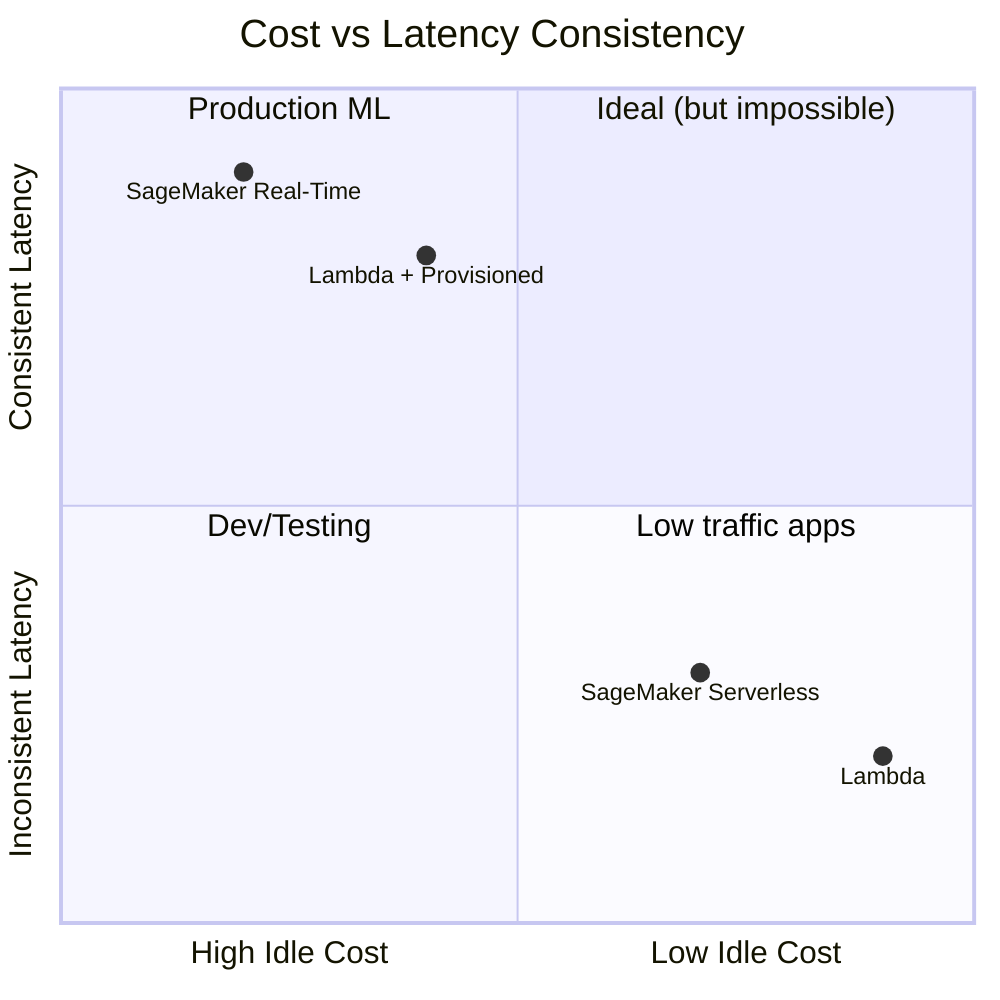
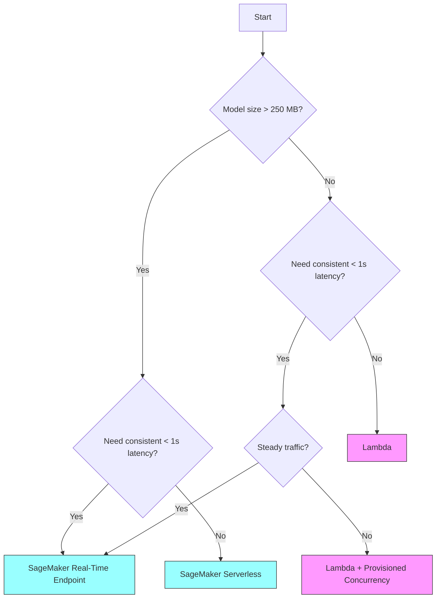

# ML Inference Architecture Options

## Option 1: Lambda (Small model, bursty traffic)

- Model loaded in Lambda memory
- No always-on cost
- Cold starts: 3-30 seconds
- Model size limit: ~250 MB

---

## Option 2: Lambda + Provisioned Concurrency (Small model, moderate traffic)

- Pre-warmed Lambda instances (no cold starts)
- Paying for warm instances when idle
- Model size limit: ~250 MB
- Consistent latency

---

## Option 3: SageMaker Serverless Inference (Medium model, bursty traffic)

- Scales to zero when idle ($0 idle cost)
- Cold starts: 1-2 minutes
- Model size: up to 4 GB
- Not suitable for sub-1-second latency requirement

---

## Option 4: SageMaker Real-Time Endpoint (Any model size, consistent latency)

- Instance always running (model pre-loaded in memory)
- No cold starts after deployment
- Typical latency: 30-120 ms
- Supports GPU, dynamic batching, multi-model
- Always-on cost ($$$)
- **Best for sub-1-second latency requirement**

---

## Cost Breakdown

### Pricing Components Per Option

### Monthly Cost Estimates (eu-central-1)

```mermaid
xychart-beta
    title "Monthly Cost by Request Volume"
    x-axis ["1K req/day", "10K req/day", "100K req/day", "1M req/day"]
    y-axis "Monthly Cost (USD)" 0 --> 300
    bar [1, 5, 45, 420]
    bar [35, 38, 65, 310]
    bar [3, 15, 130, 1200]
    bar [74, 75, 80, 110]
```

> Bars in order: Lambda, Lambda + Provisioned, SageMaker Serverless, SageMaker Real-Time

### Cost Comparison Table

| Option | Idle cost (0 requests) | 10K req/day | 100K req/day | 1M req/day | Break-even |
|--------|----------------------|-------------|--------------|------------|------------|
| **Lambda** | $0/mo | ~$5/mo | ~$45/mo | ~$420/mo | Cheapest below ~50K req/day |
| **Lambda + Provisioned** | ~$35/mo | ~$38/mo | ~$65/mo | ~$310/mo | Best for 50K-500K req/day with latency needs |
| **SageMaker Serverless** | $0/mo | ~$15/mo | ~$130/mo | ~$1200/mo | Only if bursty + model too big for Lambda |
| **SageMaker Real-Time** | ~$74/mo | ~$75/mo | ~$80/mo | ~$110/mo | Cheapest above ~500K req/day |

> Estimates assume: 128 MB Lambda memory, 50ms avg duration, ml.c5.large for SageMaker.
> Actual costs vary by region, instance type, and payload size.

### Cost Insight

**Key insight:** SageMaker Real-Time has high fixed cost but nearly flat scaling. At high traffic volumes, it becomes the cheapest per-request because you're spreading the instance cost across more requests. Lambda is cheap when idle but expensive at scale because you pay per invocation.

---

## Comparison Summary

---

## Decision Flowchart

