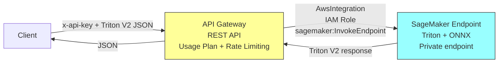
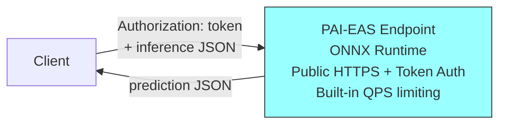
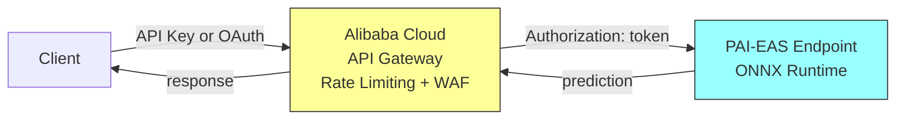

# AWS vs Alibaba Cloud Architecture Comparison

## Service Mapping

| Concern | AWS Service | Alibaba Cloud Equivalent |
|---------|------------|--------------------------|
| Model Storage | S3 | OSS (Object Storage Service) |
| ML Inference | SageMaker Real-Time Endpoint | PAI-EAS (Elastic Algorithm Service) |
| API Gateway | API Gateway | **API Gateway (API 网关)** |
| Authentication | API Gateway API Keys + IAM Role | PAI-EAS built-in token auth |
| IaC | CDK / CloudFormation | Terraform / Pulumi (or ROS natively) |
| Spot/Preemptible | Not available for inference endpoints | PAI-EAS preemptible instances |

## Architecture Diagrams

### AWS Architecture (Current)

**How it works on AWS (no Lambda):**
- API Gateway uses **direct AWS service integration** to call SageMaker
- An IAM execution role on the integration grants `sagemaker:InvokeEndpoint`
- Client sends raw Triton V2 JSON, receives raw Triton V2 response (pass-through)
- API Gateway handles: public HTTPS endpoint, API key auth, rate limiting, usage plans
- SageMaker endpoint is private - only callable via IAM (SigV4), not public HTTP

### Alibaba Cloud Architecture (This Deployment)

**How it works on Alibaba Cloud:**
- PAI-EAS natively exposes a public HTTPS endpoint
- Token-based authentication is built into the service
- No gateway or proxy needed - direct HTTP calls with token header
- Basic QPS throttling is included at the PAI-EAS service level

## Key Architectural Differences

| Aspect | AWS | Alibaba Cloud |
|--------|-----|---------------|
| Endpoint accessibility | Private (IAM/SigV4 required) | Public HTTPS (token in header) |
| Auth mechanism | API Key → API Gateway → IAM Role → SageMaker | Token directly to PAI-EAS |
| Number of services in request path | 2 (API Gateway → SageMaker) | 1 (PAI-EAS) |
| Proxy/Lambda needed | No (direct AWS integration) | No |
| Rate limiting | API Gateway usage plans | PAI-EAS built-in QPS limits |
| Extra latency from gateway | ~5-15ms (API Gateway overhead) | None |
| DDoS protection | AWS Shield + API Gateway throttling | Alibaba Cloud Anti-DDoS Basic (free tier) |
| Cost of API layer | API Gateway per-request pricing ($3.50/1M) | $0 (included in PAI-EAS) |
| Request format | Raw Triton V2 JSON (pass-through) | PAI-EAS native format |
| Spot instances for inference | Not supported | Supported (preemptible instances) |

## Why the Architectures Differ

On AWS, SageMaker endpoints are **private by design** - they require IAM SigV4 signing and cannot be called from a plain HTTP client. API Gateway solves this by:
1. Providing a public HTTPS URL
2. Handling API key authentication for external clients
3. Using an IAM role internally to call SageMaker on the client's behalf

On Alibaba Cloud, PAI-EAS endpoints are **public by design** - they expose an HTTPS URL with token auth built in. This eliminates the need for a separate gateway service. The tradeoff is less control over access policies (no usage plans, no per-client keys, no WAF) without adding the separate API Gateway service.

## Alibaba Cloud API Gateway - For Future Reference

**Service Name:** API Gateway (API 网关)
**Console:** https://apigateway.console.aliyun.com

### Benefits if Added Later

| Benefit | Description |
|---------|-------------|
| Rate limiting & throttling | Fine-grained per-user or per-IP request quotas |
| IP blacklisting/whitelisting | Block specific IPs or allow only known ranges |
| Request transformation | Modify headers, body, query params before reaching PAI-EAS |
| Multiple auth methods | OAuth 2.0, HMAC, JWT in addition to simple tokens |
| Usage plans & billing | Track usage per consumer, enable pay-per-use models |
| WAF integration | Web Application Firewall for SQL injection, XSS protection |
| Custom domain + SSL | Map your own domain with managed certificates |
| Request/response caching | Cache predictions for identical inputs |
| Monitoring & logging | Detailed access logs, latency metrics, error rates |
| Circuit breaker | Automatically stop routing to unhealthy backends |

### When You Would Need It

- Moving to production with external users
- Needing per-user API keys or OAuth flows
- Requiring strict rate limits beyond PAI-EAS built-in throttling
- Wanting a WAF layer against malicious input
- Needing request caching for repeated predictions

### Architecture With API Gateway (Future)

## Decision

**For this test deployment:** Use PAI-EAS directly without API Gateway. Token auth is sufficient, cost is lower, architecture is simpler, and latency is reduced.

**For production:** Re-evaluate adding Alibaba Cloud API Gateway for rate limiting, WAF, and multi-tenant auth.
