# Model Serving Decision Guide

This document walks through the decisions in logical order: model format → container type → deployment mode → architecture.

---

## Step 1: Choose Your Model Format

The format you store your model in determines everything downstream.

### What Formats Are Available?

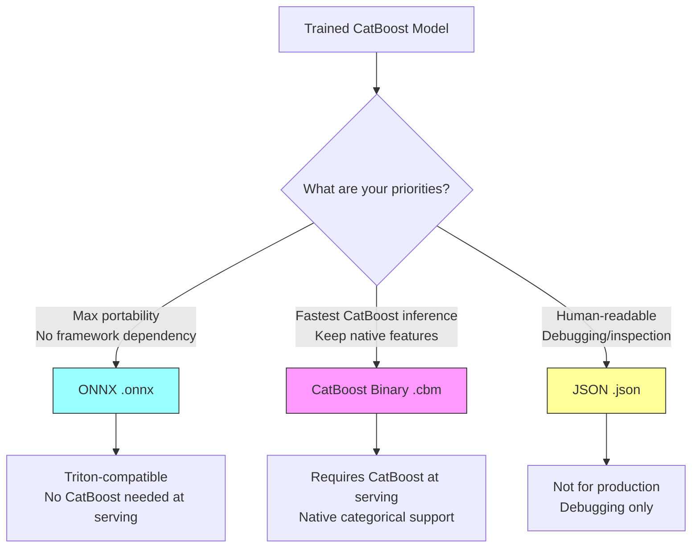

---

### ONNX (.onnx) — Pros and Cons

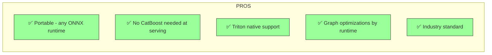

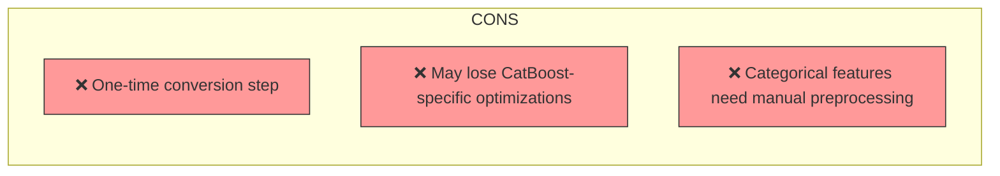

---

### CatBoost Binary (.cbm) — Pros and Cons

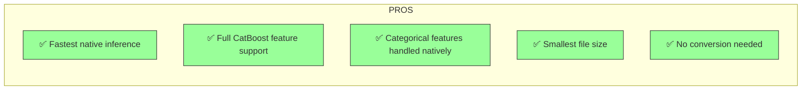

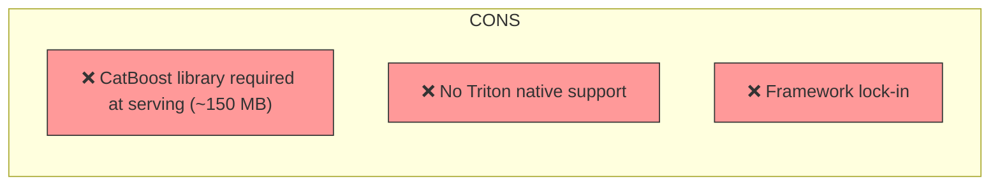

---

### JSON (.json) — Pros and Cons

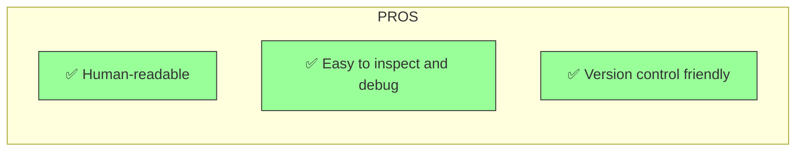

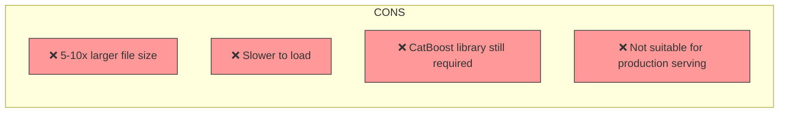

---

### Performance Comparison

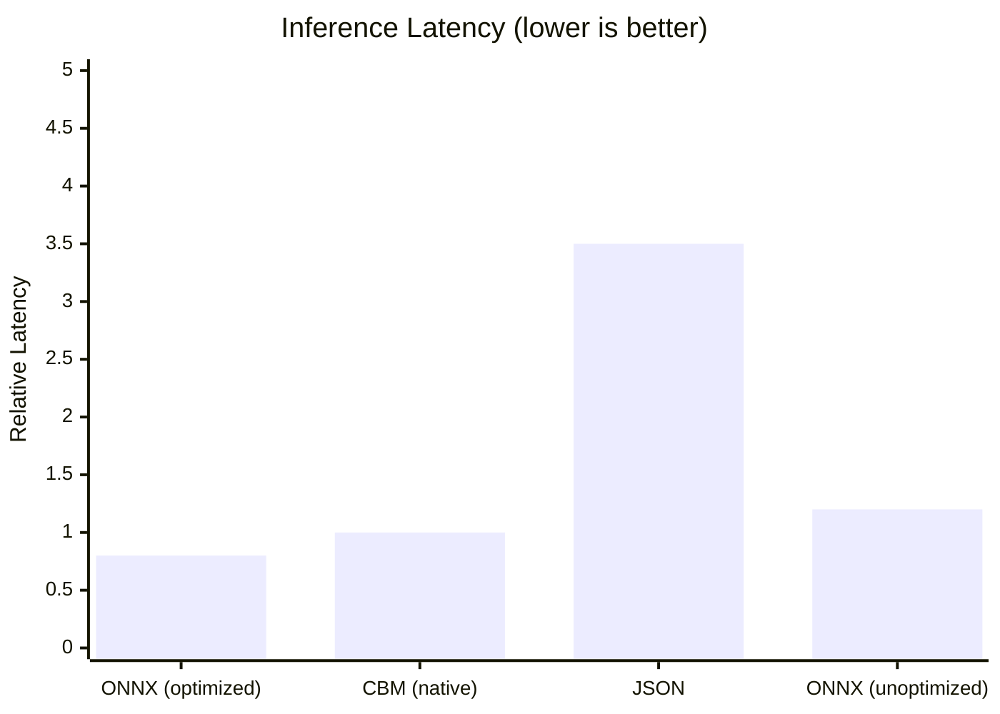

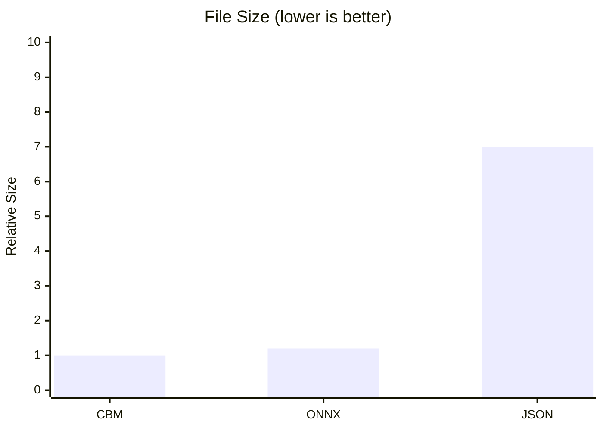

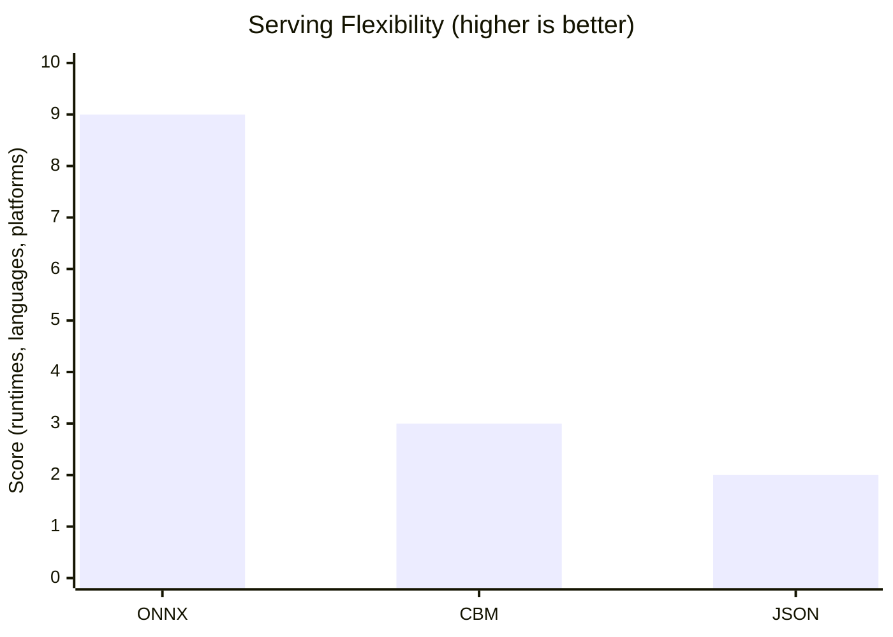

---

### Format Decision

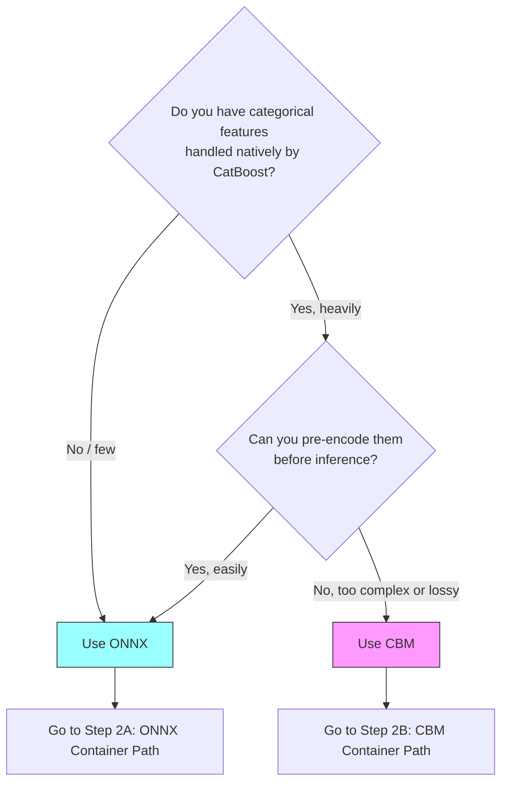

---

## Step 2: Choose Your Container (Based on Format)

The model format determines which containers are available.

### Step 2A: ONNX → Container Options

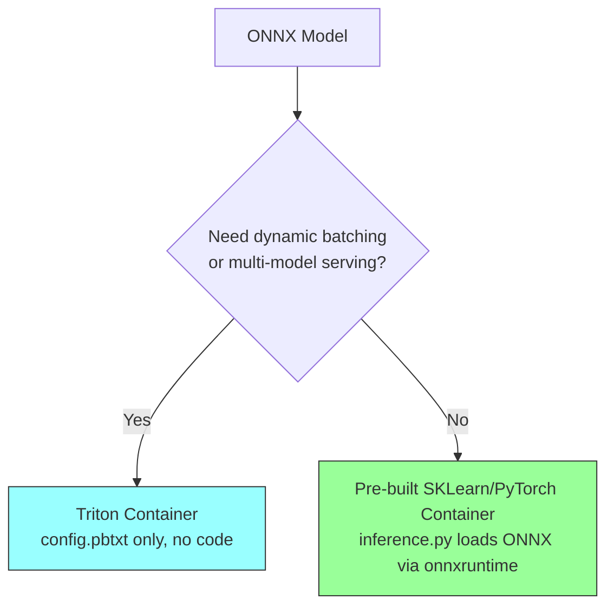

| Option | Code needed | Batching | Complexity |
|--------|------------|----------|-----------|
| Triton container | None (config.pbtxt only) | Built-in | Low |
| Framework container | inference.py (10-20 lines) | Manual | Low |

---

### Step 2B: CBM → Container Options

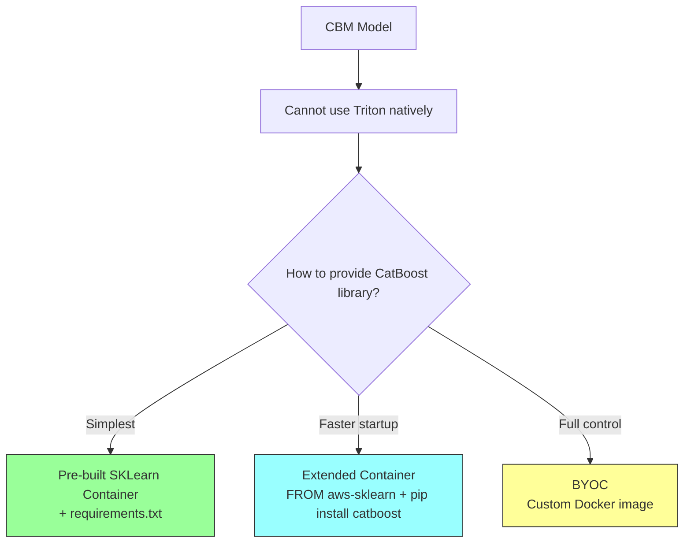

---

### Container Options Explained

#### Pre-built Container + requirements.txt (Start Here)

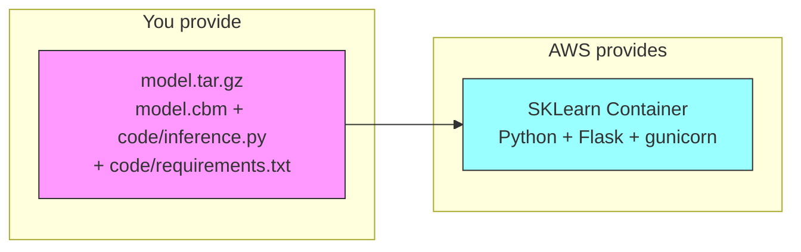

- CatBoost installed at container startup via requirements.txt
- Startup delay: 30-60 sec (installs catboost each time an instance boots)
- No Docker knowledge needed

#### Extended Container (Production)

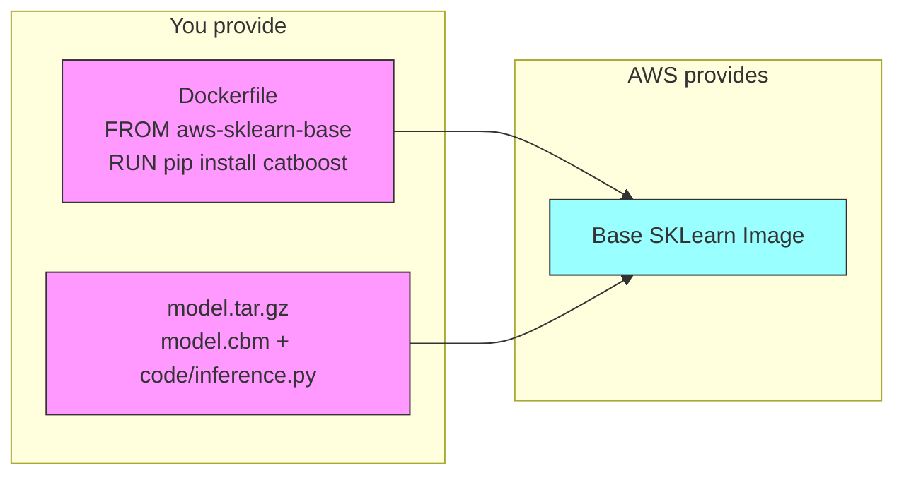

- CatBoost pre-baked into the image — no install delay
- Reproducible environment (pinned versions)
- Requires ECR push (docker build + push)

#### BYOC — Bring Your Own Container (Only If Needed)

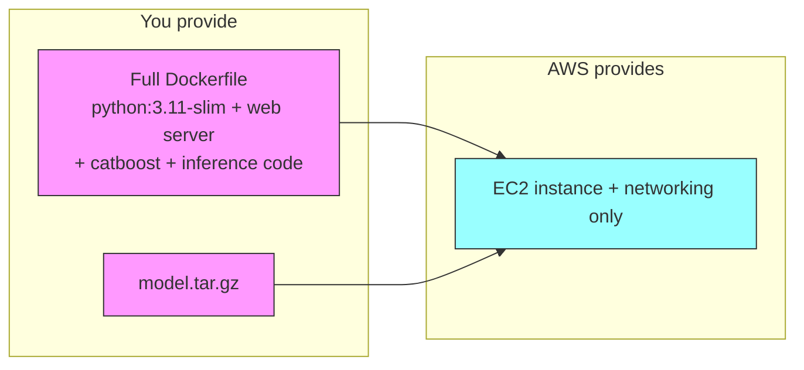

- You build everything: web server, health check, model loading
- Must implement `GET /ping` and `POST /invocations` on port 8080
- Only needed if pre-built containers are missing system libraries

---

### Container Comparison

| Option | You manage | AWS manages | Startup speed | Flexibility |
|--------|-----------|-------------|--------------|-------------|
| Pre-built + requirements.txt | inference.py + model | Container, web server | Slow (installs deps) | Moderate |
| Extended Container | Dockerfile + inference.py + model | Base image | Fast (deps pre-baked) | High |
| BYOC | Everything | Just the instance | Fast | Unlimited |

---

## Step 3: Choose Your Deployment Mode (Based on Latency Needs)

Now you have a model format and container. How should it run?

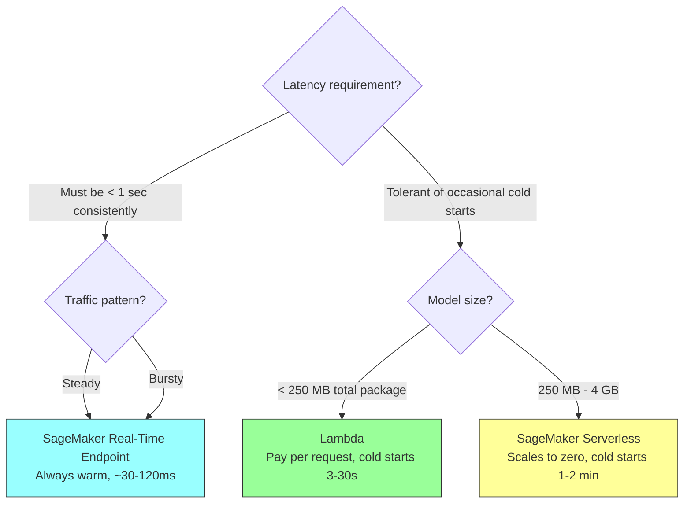

### Deployment Mode Comparison

| Mode | Idle cost | Cold start | Latency (warm) | Model size limit |
|------|----------|-----------|----------------|-----------------|
| Lambda | $0/mo | 3-30 sec | 5-50 ms | ~250 MB |
| Lambda + Provisioned Concurrency | ~$35/mo | None | 5-50 ms | ~250 MB |
| SageMaker Serverless | $0/mo | 1-2 min | 50-200 ms | 4 GB |
| **SageMaker Real-Time** | **~$74/mo** | **None** | **30-120 ms** | **Unlimited** |

---

## Step 4: Final Architecture

All decisions flow together into the architecture:

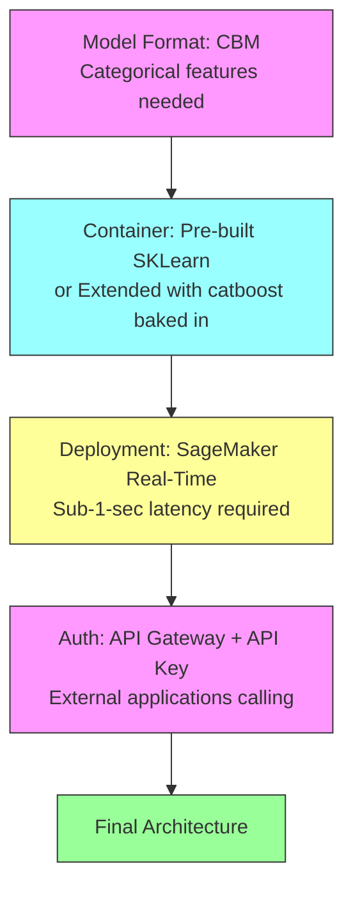

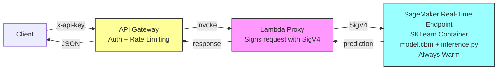

| Component | Role | Why |
|-----------|------|-----|
| API Gateway | API key auth, rate limiting, HTTPS | External apps need auth without AWS credentials |
| Lambda Proxy | Signs request with SigV4, forwards to SageMaker | SageMaker requires IAM auth on every request |
| SageMaker Endpoint | Always-warm instance, model in memory | Sub-1-sec latency, no cold starts |
| SKLearn Container | Runtime with CatBoost installed | Provides Python + web server + CatBoost |
| inference.py | Load model, parse input, predict, format output | CBM needs custom code (unlike ONNX + Triton) |
| model.cbm | Native CatBoost model | Preserves categorical feature handling |

---

## Recommended Implementation Path

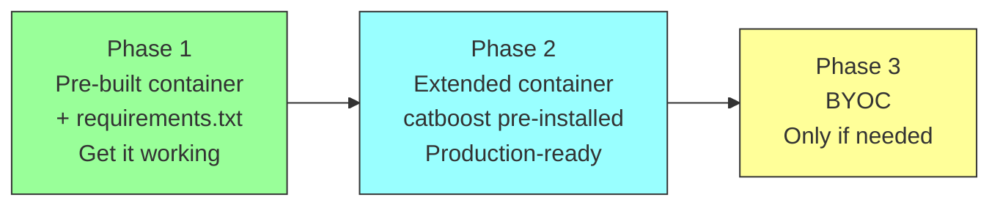

---

## Quick Reference: Format → Everything Else

| Format | Container | Inference code | Triton? | Deployment |
|--------|-----------|---------------|---------|-----------|
| **.onnx** | Triton (pre-built) | None — config.pbtxt only | Yes (native) | Any mode |
| **.onnx** | SKLearn/PyTorch (pre-built) | inference.py (loads via onnxruntime) | No | Any mode |
| **.cbm** | SKLearn (pre-built) + requirements.txt | inference.py (loads via catboost) | No | Any mode |
| **.cbm** | Extended container | inference.py (loads via catboost) | No | Any mode |
| **.cbm** | BYOC | Full custom serve.py | No | Any mode |
| **.json** | Not recommended for production | — | — | — |

---

## Files You Need Per Approach

### Built-in Algorithm (1 file)

```
project/
├── data/
│   └── train.csv                  ← your training data (upload to S3)
└── train_and_deploy.py            ← script to train + deploy
```

No inference.py, no Dockerfile, no model packaging. SageMaker trains AND serves automatically.

**train_and_deploy.py:**

```python
import sagemaker
from sagemaker import image_uris
from sagemaker.estimator import Estimator

session = sagemaker.Session()
role = "arn:aws:iam::123456789:role/SageMakerRole"

image = image_uris.retrieve("xgboost", session.boto_region_name, version="1.7-1")

estimator = Estimator(
    image_uri=image,
    role=role,
    instance_count=1,
    instance_type="ml.m5.large",
    hyperparameters={"num_round": 100, "objective": "multi:softmax", "num_class": 10},
)

estimator.fit({"train": "s3://my-bucket/data/train.csv"})
predictor = estimator.deploy(instance_type="ml.c5.large", initial_instance_count=1)
```

**Available built-in algorithms:**

| Algorithm | Use case |
|-----------|----------|
| XGBoost | Tabular classification/regression |
| Linear Learner | Classification/regression |
| K-Nearest Neighbors | Classification/regression |
| Factorization Machines | Recommendation, click prediction |
| BlazingText | Text classification, word embeddings |
| Image Classification | Image labeling (ResNet-based) |
| Object Detection | Bounding boxes in images |
| DeepAR | Time series forecasting |
| Random Cut Forest | Anomaly detection |

**Limitation:** No built-in CatBoost. The list is fixed by AWS. If your algorithm isn't on it, you can't use this approach.

---

### Pre-built Container + requirements.txt (4 files)

```
project/
├── model.cbm                      ← your trained model
├── code/
│   ├── inference.py               ← 4 functions (model_fn, input_fn, predict_fn, output_fn)
│   └── requirements.txt           ← "catboost==1.2.7"
├── package.py                     ← script to create model.tar.gz
└── deploy.py                      ← script to deploy to SageMaker
```

**model.tar.gz contents (uploaded to S3):**

```
model.tar.gz
├── model.cbm
└── code/
    ├── inference.py
    └── requirements.txt
```

---

### Extended Container (5 files)

```
project/
├── model.cbm                      ← your trained model
├── code/
│   └── inference.py               ← same 4 functions
├── docker/
│   └── Dockerfile                 ← extends AWS base image (2-3 lines)
├── package.py                     ← script to create model.tar.gz
├── build_and_push.sh              ← script to build + push image to ECR
└── deploy.py                      ← script to deploy (points to your ECR image)
```

**Dockerfile:**

```dockerfile
FROM 763104351884.dkr.ecr.eu-central-1.amazonaws.com/sklearn-inference:1.2-1
RUN pip install --no-cache-dir catboost==1.2.7
```

**model.tar.gz contents:**

```
model.tar.gz
├── model.cbm
└── code/
    └── inference.py
```

No requirements.txt needed — catboost is already in the image.

---

### BYOC — Bring Your Own Container (8-9 files)

```
project/
├── model.cbm                      ← your trained model
├── code/
│   ├── serve.py                   ← web server (Flask/gunicorn)
│   ├── inference.py               ← model loading + prediction logic
│   └── wsgi.py                    ← WSGI entry point
├── docker/
│   ├── Dockerfile                 ← full custom image
│   └── nginx.conf                 ← (optional) reverse proxy config
├── requirements.txt               ← all dependencies
├── package.py                     ← script to create model.tar.gz
├── build_and_push.sh              ← script to build + push image to ECR
└── deploy.py                      ← script to deploy
```

**Dockerfile:**

```dockerfile
FROM python:3.11-slim
RUN pip install --no-cache-dir flask gunicorn catboost numpy
COPY code/ /opt/program/
WORKDIR /opt/program
EXPOSE 8080
ENTRYPOINT ["gunicorn", "--bind", "0.0.0.0:8080", "wsgi:app"]
```

**serve.py (you build the web server):**

```python
from flask import Flask, request, jsonify
from inference import load_model, predict

app = Flask(__name__)
model = load_model("/opt/ml/model")

@app.route("/ping", methods=["GET"])
def health():
    return "", 200

@app.route("/invocations", methods=["POST"])
def invoke():
    data = request.get_json()
    result = predict(data, model)
    return jsonify(result)
```

**model.tar.gz contents:**

```
model.tar.gz
└── model.cbm
```

Just the model — all code is baked into the Docker image.

---

### Files Comparison

| | Built-in | Pre-built | Extended | BYOC |
|---|---|---|---|---|
| **Files you write** | 1 | 4 | 5 | 8-9 |
| **inference.py** | ❌ | ✅ (4 functions) | ✅ (4 functions) | ✅ (custom structure) |
| **requirements.txt** | ❌ | ✅ (in tar.gz) | ❌ (baked in image) | ✅ (in Dockerfile) |
| **Dockerfile** | ❌ | ❌ | ✅ (2-3 lines) | ✅ (full image) |
| **Web server (serve.py)** | ❌ (AWS provides) | ❌ (AWS provides) | ❌ (AWS provides) | ✅ (you write it) |
| **Health check (/ping)** | ❌ (AWS provides) | ❌ (AWS provides) | ❌ (AWS provides) | ✅ (you write it) |
| **build_and_push.sh** | ❌ | ❌ | ✅ | ✅ |
| **Model packaging** | ❌ (automatic) | ✅ (model.tar.gz) | ✅ (model.tar.gz) | ✅ (model.tar.gz) |
| **Training** | SageMaker handles | You train elsewhere | You train elsewhere | You train elsewhere |
| **model.tar.gz contains** | N/A (auto) | model + code | model + code | model only |
| **Docker knowledge needed** | No | No | Minimal | Yes |
| **Startup speed** | Fast | Slow (installs deps) | Fast | Fast |
| **CatBoost support** | ❌ | ✅ | ✅ | ✅ |

---

### Responsibility Progression

```mermaid
graph TD
    subgraph "Built-in Algorithm"
        Z1["You write: training script + data"]
        Z2["AWS provides: algorithm + container + training + inference + web server + everything"]
    end

    subgraph "Pre-built Container"
        A1["You write: inference.py + requirements.txt + model"]
        A2["AWS provides: web server + runtime + health check + routing"]
    end

    subgraph "Extended Container"
        B1["You write: Dockerfile + inference.py + model"]
        B2["AWS provides: web server + runtime + health check + routing"]
    end

    subgraph "BYOC"
        C1["You write: Dockerfile + serve.py + inference.py + health check + wsgi.py + model"]
        C2["AWS provides: EC2 instance + networking (that's it)"]
    end

    style Z1 fill:#f9f,stroke:#333
    style Z2 fill:#9f9,stroke:#333
    style A1 fill:#f9f,stroke:#333
    style A2 fill:#9f9,stroke:#333
    style B1 fill:#f9f,stroke:#333
    style B2 fill:#9f9,stroke:#333
    style C1 fill:#f9f,stroke:#333
    style C2 fill:#9f9,stroke:#333
```
